# Cart\-Pole Problem
<a name="beginToc"></a>

## Table of Contents
&emsp;[Setting up the State\-space equations](#setting-up-the-state-space-equations)
 
&emsp;[Inserting real values and creating the State Space object](#inserting-real-values-and-creating-the-state-space-object)
 
&emsp;[Stabilizing the System with SS Feedback P control](#stabilizing-the-system-with-ss-feedback-p-control)
 
&emsp;&emsp;[Animation Parameters](#animation-parameters)
 
&emsp;&emsp;[Animating the system response to initial parameters](#animating-the-system-response-to-initial-parameters)
 
&emsp;[Desired output tracking with SS Feedback P control](#desired-output-tracking-with-ss-feedback-p-control)
 
&emsp;&emsp;[Animating the system response to a desired output](#animating-the-system-response-to-a-desired-output)
 
&emsp;[Stabilize the System with SS Feedback PI control](#stabilize-the-system-with-ss-feedback-pi-control)
 
&emsp;&emsp;[Animating the system response to a desired output](#animating-the-system-response-to-a-desired-output)
 
&emsp;[Stabilize System with Luenberger Observer Feedback & PI Control](#stabilize-system-with-luenberger-observer-feedback-pi-control)
 
&emsp;&emsp;[Theory:](#theory-)
 
&emsp;&emsp;[Implementation:](#implementation-)
 
<a name="endToc"></a>


The equations of motion for the cart and the pole are as follows, where:


g = gravity = 9.8 m/s^2


J = inertial constant of the pole


x = cart position


th = theta = pole angle w.r.t. vertical up, +90deg when horizontal to the right


m = mass of the pole


m\_c = mass of the cart


M = m + m\_c


 $\mu_c$ = friction coefficient of the cart


r = radius of the cart wheels


f = force applied to the cart (via the torque generated by its motors)


l = location of the CoM of the pole


O = origin


Q = CoM of the pole


P = pivot point of the pole


C = CoM of the Cart

```matlab
syms m_c m x_ddot x_dot x theta_ddot theta_dot theta l mu_c J g f r
% eqtn 12-F
M= m_c + m;
Ff = -mu_c*M*g*x_dot/r; % look more closely at friction and how it applies force to the cart's movement
eqn_cart = m_c*x_ddot + m*(l*theta_ddot*cos(theta) - l*theta_dot^2*sin(theta) + x_ddot) - Ff == f
```
eqn_cart = 
 $\displaystyle m\,{\left(-l\,\sin \left(\theta \right)\,{\dot{\theta} }^2 +\ddot{x} +l\,\ddot{\theta} \,\cos \left(\theta \right)\right)}+m_c \,\ddot{x} +\frac{g\,\mu_c \,\dot{x} \,{\left(m+m_c \right)}}{r}=f$
 

```matlab
% eqtn 18
eqn_pend = m*l*(l*theta_ddot + x_ddot*cos(theta)) - m*g*l*sin(theta) + J*theta_ddot == 0
```
eqn_pend = 
 $\displaystyle J\,\ddot{\theta} +l\,m\,{\left(l\,\ddot{\theta} +\ddot{x} \,\cos \left(\theta \right)\right)}-g\,l\,m\,\sin \left(\theta \right)=0$
 

```matlab

% Deriving the solutions for ONLY x_ddot and theta_ddot
[x_ddot_sol, theta_ddot_sol] = solve([eqn_pend,eqn_cart],[x_ddot,theta_ddot])
```
x_ddot_sol = 
 $\displaystyle -\frac{g\,l^2 \,m^2 \,\mu_c \,\dot{x} -f\,l^2 \,m\,r-l^3 \,m^2 \,r\,{\dot{\theta} }^2 \,\sin \left(\theta \right)-J\,f\,r+J\,g\,m\,\mu_c \,\dot{x} +J\,g\,m_c \,\mu_c \,\dot{x} +g\,l^2 \,m\,m_c \,\mu_c \,\dot{x} +g\,l^2 \,m^2 \,r\,\cos \left(\theta \right)\,\sin \left(\theta \right)-J\,l\,m\,r\,{\dot{\theta} }^2 \,\sin \left(\theta \right)}{r\,{\left(-l^2 \,m^2 \,{\cos \left(\theta \right)}^2 +l^2 \,m^2 +m_c \,l^2 \,m+J\,m+J\,m_c \right)}}$
 
theta_ddot_sol = 
 $\displaystyle \frac{l\,m\,{\left(-l\,m\,r\,\cos \left(\theta \right)\,\sin \left(\theta \right)\,{\dot{\theta} }^2 -f\,r\,\cos \left(\theta \right)+g\,m\,r\,\sin \left(\theta \right)+g\,m_c \,r\,\sin \left(\theta \right)+g\,m\,\mu_c \,\dot{x} \,\cos \left(\theta \right)+g\,m_c \,\mu_c \,\dot{x} \,\cos \left(\theta \right)\right)}}{r\,{\left(-l^2 \,m^2 \,{\cos \left(\theta \right)}^2 +l^2 \,m^2 +m_c \,l^2 \,m+J\,m+J\,m_c \right)}}$
 

# Setting up the State\-space equations
```matlab
syms beta_1 beta_2 beta_3 beta_4 u t
% f = [beta_1_dot; beta_2_dot; beta_3_dot; beta_4_dot] 
%   = [x_dot; x_ddot; theta_dot; theta_ddot]
ss_x_theta = [x_dot;
    x_ddot_sol;
    theta_dot;
    theta_ddot_sol]
```
ss_x_theta = 
 $\displaystyle \begin{array}{l} \left(\begin{array}{c} \dot{x} \newline -\frac{g\,l^2 \,m^2 \,\mu_c \,\dot{x} -f\,l^2 \,m\,r-l^3 \,m^2 \,r\,{\dot{\theta} }^2 \,\sin \left(\theta \right)-J\,f\,r+J\,g\,m\,\mu_c \,\dot{x} +J\,g\,m_c \,\mu_c \,\dot{x} +g\,l^2 \,m\,m_c \,\mu_c \,\dot{x} +g\,l^2 \,m^2 \,r\,\cos \left(\theta \right)\,\sin \left(\theta \right)-J\,l\,m\,r\,{\dot{\theta} }^2 \,\sin \left(\theta \right)}{\sigma_1 }\newline \dot{\theta} \newline \frac{l\,m\,{\left(-l\,m\,r\,\cos \left(\theta \right)\,\sin \left(\theta \right)\,{\dot{\theta} }^2 -f\,r\,\cos \left(\theta \right)+g\,m\,r\,\sin \left(\theta \right)+g\,m_c \,r\,\sin \left(\theta \right)+g\,m\,\mu_c \,\dot{x} \,\cos \left(\theta \right)+g\,m_c \,\mu_c \,\dot{x} \,\cos \left(\theta \right)\right)}}{\sigma_1 } \end{array}\right)\\\mathrm{}\\\textrm{where}\\\mathrm{}\\\;\;\sigma_1 =r\,{\left(-l^2 \,m^2 \,{\cos \left(\theta \right)}^2 +l^2 \,m^2 +m_c \,l^2 \,m+J\,m+J\,m_c \right)}\end{array}$
 

```matlab
ss_beta = subs(ss_x_theta,[x, x_dot, theta, theta_dot, f],[beta_1, beta_2, beta_3, beta_4, u]);
beta = [beta_1; beta_2; beta_3; beta_4];
% Linearize the system
% per Lecture 2 of ME6401 Linear Controls, take the Jacobian of the system
% of equations to get the partial differential wrt each state variable, and
% the input variable
Asym = jacobian(ss_beta,beta)
```
Asym = 
 $\displaystyle \begin{array}{l} \left(\begin{array}{cccc} 0 & 1 & 0 & 0\newline 0 & -\frac{g\,\mu_c \,l^2 \,m^2 +g\,m_c \,\mu_c \,l^2 \,m+J\,g\,\mu_c \,m+J\,g\,m_c \,\mu_c }{r\,\sigma_1 } & \frac{r\,{\beta_4 }^2 \,l^3 \,m^2 \,\cos \left(\beta_3 \right)+J\,r\,{\beta_4 }^2 \,l\,m\,\cos \left(\beta_3 \right)-g\,r\,l^2 \,m^2 \,{\cos \left(\beta_3 \right)}^2 +g\,r\,l^2 \,m^2 \,{\sin \left(\beta_3 \right)}^2 }{r\,\sigma_1 }+\frac{2\,l^2 \,m^2 \,\cos \left(\beta_3 \right)\,\sin \left(\beta_3 \right)\,{\left(\beta_2 \,g\,l^2 \,m^2 \,\mu_c -l^2 \,m\,r\,u-{\beta_4 }^2 \,l^3 \,m^2 \,r\,\sin \left(\beta_3 \right)-J\,r\,u+J\,\beta_2 \,g\,m\,\mu_c +J\,\beta_2 \,g\,m_c \,\mu_c +\beta_2 \,g\,l^2 \,m\,m_c \,\mu_c +g\,l^2 \,m^2 \,r\,\cos \left(\beta_3 \right)\,\sin \left(\beta_3 \right)-J\,{\beta_4 }^2 \,l\,m\,r\,\sin \left(\beta_3 \right)\right)}}{r\,{\sigma_1 }^2 } & \frac{2\,\beta_4 \,r\,\sin \left(\beta_3 \right)\,l^3 \,m^2 +2\,J\,\beta_4 \,r\,\sin \left(\beta_3 \right)\,l\,m}{r\,\sigma_1 }\newline 0 & 0 & 0 & 1\newline 0 & \frac{l\,m\,{\left(g\,m\,\mu_c \,\cos \left(\beta_3 \right)+g\,m_c \,\mu_c \,\cos \left(\beta_3 \right)\right)}}{r\,\sigma_1 } & \frac{l\,m\,{\left(r\,u\,\sin \left(\beta_3 \right)+g\,m\,r\,\cos \left(\beta_3 \right)+g\,m_c \,r\,\cos \left(\beta_3 \right)-{\beta_4 }^2 \,l\,m\,r\,{\cos \left(\beta_3 \right)}^2 +{\beta_4 }^2 \,l\,m\,r\,{\sin \left(\beta_3 \right)}^2 -\beta_2 \,g\,m\,\mu_c \,\sin \left(\beta_3 \right)-\beta_2 \,g\,m_c \,\mu_c \,\sin \left(\beta_3 \right)\right)}}{r\,\sigma_1 }-\frac{2\,l^3 \,m^3 \,\cos \left(\beta_3 \right)\,\sin \left(\beta_3 \right)\,{\left(-l\,m\,r\,\cos \left(\beta_3 \right)\,\sin \left(\beta_3 \right)\,{\beta_4 }^2 -r\,u\,\cos \left(\beta_3 \right)+g\,m\,r\,\sin \left(\beta_3 \right)+g\,m_c \,r\,\sin \left(\beta_3 \right)+\beta_2 \,g\,m\,\mu_c \,\cos \left(\beta_3 \right)+\beta_2 \,g\,m_c \,\mu_c \,\cos \left(\beta_3 \right)\right)}}{r\,{\sigma_1 }^2 } & -\frac{2\,\beta_4 \,l^2 \,m^2 \,\cos \left(\beta_3 \right)\,\sin \left(\beta_3 \right)}{\sigma_1 } \end{array}\right)\\\mathrm{}\\\textrm{where}\\\mathrm{}\\\;\;\sigma_1 =-l^2 \,m^2 \,{\cos \left(\beta_3 \right)}^2 +l^2 \,m^2 +m_c \,l^2 \,m+J\,m+J\,m_c \end{array}$
 

```matlab
Bsym = jacobian(ss_beta,u)
```
Bsym = 
 $\displaystyle \begin{array}{l} \left(\begin{array}{c} 0\newline \frac{m\,r\,l^2 +J\,r}{r\,\sigma_1 }\newline 0\newline -\frac{l\,m\,\cos \left(\beta_3 \right)}{\sigma_1 } \end{array}\right)\\\mathrm{}\\\textrm{where}\\\mathrm{}\\\;\;\sigma_1 =-l^2 \,m^2 \,{\cos \left(\beta_3 \right)}^2 +l^2 \,m^2 +m_c \,l^2 \,m+J\,m+J\,m_c \end{array}$
 

```matlab

% per problem diagram, setting equilibrium point at theta = 0 (vertical) and
% arbitrarily selecting x = 0 for simplicity
A0 = subs(Asym,[beta_1, beta_2, beta_3, beta_4], [0, 0, 0, 0])
```
A0 = 
 $\displaystyle \begin{array}{l} \left(\begin{array}{cccc} 0 & 1 & 0 & 0\newline 0 & -\frac{g\,\mu_c \,l^2 \,m^2 +g\,m_c \,\mu_c \,l^2 \,m+J\,g\,\mu_c \,m+J\,g\,m_c \,\mu_c }{r\,\sigma_1 } & -\frac{g\,l^2 \,m^2 }{\sigma_1 } & 0\newline 0 & 0 & 0 & 1\newline 0 & \frac{l\,m\,{\left(g\,m\,\mu_c +g\,m_c \,\mu_c \right)}}{r\,\sigma_1 } & \frac{l\,m\,{\left(g\,m\,r+g\,m_c \,r\right)}}{r\,\sigma_1 } & 0 \end{array}\right)\\\mathrm{}\\\textrm{where}\\\mathrm{}\\\;\;\sigma_1 =m\,m_c \,l^2 +J\,m+J\,m_c \end{array}$
 

```matlab
B0 = subs(Bsym,[beta_1, beta_2, beta_3, beta_4], [0, 0, 0, 0])
```
B0 = 
 $\displaystyle \left(\begin{array}{c} 0\newline \frac{m\,r\,l^2 +J\,r}{r\,{\left(m\,m_c \,l^2 +J\,m+J\,m_c \right)}}\newline 0\newline -\frac{l\,m}{m\,m_c \,l^2 +J\,m+J\,m_c } \end{array}\right)$
 

```matlab

% Thus, our linearized state-space representation of the system can be
% represented as: diff(beta,t) = A0*beta + B0*u

% where beta_3 is the deviation from the equil point, theta = 0
```

# Inserting real values and creating the State Space object
```matlab
g_real = 9.8; % [m/sec^2]
m_motor = 9.5*2/1000; % [kg] documentation
m_bump = 35/1000; % [kg] documentation
m_batt = 138/1000; % [kg] measured
m_wheels = 39.7/1000; % [kg] documentation
m_cb = (200/1000 - m_motor - m_bump - m_wheels); % [kg] measured value
m_c_real = (m_wheels); % [kg] - mass of cart (i.e. the wheels of the segway)
m_real = m_motor + m_bump + m_batt + m_cb; % [kg] - mass of "pole"
mu_c_real = 0.02; % bearing viscous friction coeff. for rotational speed

% Calculating CoM of the pole w.r.t. location of axis of rotation
x_rot = 31/1000; % [m] axis of rotation is NOT at the bottom of the pole
x_motor = 0/1000; % [m] motor w.r.t. rotation axis
l_cb = 109.2/1000; % [m] lengh of control board
x_cb = l_cb/2 - x_rot; % [m] control board w.r.t. rotation axis
l_batt = 95.7/1000; % [m] length of batteries
x_batt = l_batt/2 - x_rot + 2.5/1000; % [m] batteries w.r.t. rotation axis
x_bump = l_cb - 30/1000 + 40/1000 - x_rot; % [m] bumpers w.r.t. rotation axis
y_motor = 16.416/1000; y_cb = 0; y_batt = 0; y_bump = 0; % [m] w.r.t. rotation axis
CM_x_rot = (m_motor*x_motor + m_cb*x_cb + m_batt*x_batt + m_bump*x_bump)/(m_real); % [m]
CM_y_rot = y_motor*m_motor/m_real; % [m]
CM_rot = sqrt(CM_x_rot^2 + CM_y_rot^2); % [m] length from CM of pole to axis of rotation

l_real = CM_rot; % [m] - length to pole CoM

% Calculating Inertia of the Pole:
I_motor = m_motor*y_motor^2; % [kg m^2] point mass inertia of motors
I_bump = m_bump*x_bump^2; % [kg m^2] point mass inertia of bumpers
% Parallel axis theorem: I = Icm + m h^2
% Inertia of a pole of equally distributed mass about one end: I = m l^2/3 
% Inertia of a pole of equally distributed mass about the CoM: I = m l^2/12
I_batt = m_batt*(l_batt/2)^2/12 + m_batt*x_batt^2; % [kg m^2] inertia of batteries
I_cb = m_cb*(l_cb/2)^2/12 + m_cb*x_cb^2; % [kg m^2] inertia of control board

J_real = (I_motor + I_bump + I_batt + I_cb); % kg*m^2 - mass moment of inertia of the pole (1/12*m*(length)^2)

r_real = 40/1000; % [m]

symvar(A0)
```
ans = 
 $\displaystyle \left(\begin{array}{ccccccc} J & g & l & m & m_c  & \mu_c  & r \end{array}\right)$
 

```matlab
symvar(B0)
```
ans = 
 $\displaystyle \left(\begin{array}{ccccc} J & l & m & m_c  & r \end{array}\right)$
 

```matlab
A = double(subs(A0,[g,m_c,m,mu_c,l,J,r],[g_real,m_c_real,m_real,mu_c_real,l_real,J_real,r_real]));
B = double(subs(B0,[g,m_c,m,mu_c,l,J,r],[g_real,m_c_real,m_real,mu_c_real,l_real,J_real,r_real]));
% outputting both the x-position and theta-angle
C = [1 0 0 0; 0 0 0 1];
D = [0;0];
states = {'x' 'x_dot' 'theta' 'theta_dot'};
inputs = {'u'};
outputs = {'x'; 'theta'};
olsys = ss(A,B,C,D,'statename',states,'inputname',inputs,'outputname',outputs)
```

```matlabTextOutput
olsys =
 
  A = 
                      x      x_dot      theta  theta_dot
   x                  0          1          0          0
   x_dot              0      -7.02      -4.24          0
   theta              0          0          0          1
   theta_dot          0      86.62      173.2          0
 
  B = 
                  u
   x              0
   x_dot      4.238
   theta          0
   theta_dot  -52.3
 
  C = 
                  x      x_dot      theta  theta_dot
   x              1          0          0          0
   theta          0          0          0          1
 
  D = 
          u
   x      0
   theta  0
 
Continuous-time state-space model.
Model Properties
```

```matlab
olsys_tf = tf(olsys)
```

```matlabTextOutput
olsys_tf =
 
  From input "u" to output...
         4.238 s^2 - 1.506e-14 s - 512.5
   x:  ------------------------------------
       s^4 + 7.02 s^3 - 173.2 s^2 - 848.8 s
 
           -52.3 s^2 + 2.729e-14 s - 5.402e-13
   theta:  -----------------------------------
            s^3 + 7.02 s^2 - 173.2 s - 848.8
 
Continuous-time transfer function.
Model Properties
```

```matlab
size(olsys_tf)
```

```matlabTextOutput
Transfer function with 2 outputs and 1 inputs.
```

```matlab
figure; step(olsys_tf) % notice the instability of the system
```

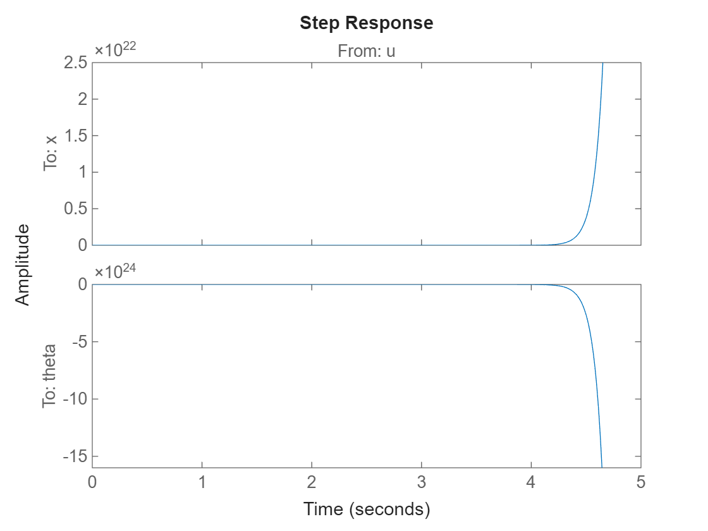

# Stabilizing the System with SS Feedback P control
```matlab
figure;
rlocus(olsys_tf(2)) % root locus of theta/u
```

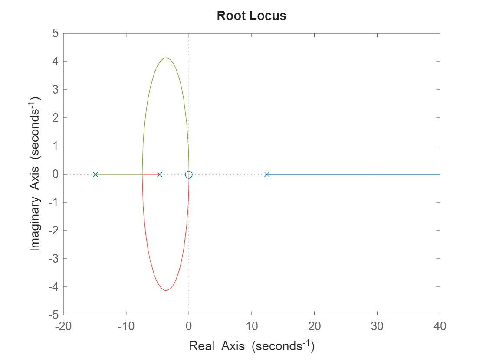

```matlab
% from the root locus plot theta/u, we see that there will always be a pole
% in the RHP, so we have to do a state-space feedback to stabilize the system

% seeing if the system is controllable and observable (full rank = yes)
rank(ctrb(A,B))
```

```matlabTextOutput
ans = 4
```

```matlab
rank(obsv(A,C))
```

```matlabTextOutput
ans = 4
```

```matlab
% arbitrary location of stable poles 2022/09/28
% TO DO - design response of system to find desired pole locations
p = [-3, -4, -5, -6];
K = acker(A,B,p)
```

```matlabTextOutput
K = 1x4
   -0.7024   -2.3235   -5.6447   -0.3983

```

```matlab
% u = -Kx + r => xdot = (A - B*K)*x + B*r
Abar = A-B*K;
% Closed Loop system
clsys = ss(Abar,B,C,D,'statename',states,'inputname',inputs,'outputname',outputs)
```

```matlabTextOutput
clsys =
 
  A = 
                      x      x_dot      theta  theta_dot
   x                  0          1          0          0
   x_dot          2.977      2.828      19.69      1.688
   theta              0          0          0          1
   theta_dot     -36.73      -34.9       -122     -20.83
 
  B = 
                  u
   x              0
   x_dot      4.238
   theta          0
   theta_dot  -52.3
 
  C = 
                  x      x_dot      theta  theta_dot
   x              1          0          0          0
   theta          0          0          0          1
 
  D = 
          u
   x      0
   theta  0
 
Continuous-time state-space model.
Model Properties
```

```matlab
clsys_tf = tf(clsys)
```

```matlabTextOutput
clsys_tf =
 
  From input "u" to output...
         4.238 s^2 + 4.517e-14 s - 512.5
   x:  ------------------------------------
       s^4 + 18 s^3 + 119 s^2 + 342 s + 360
 
           -52.3 s^3 - 3.43e-14 s^2 - 7.806e-15 s - 5.927e-49
   theta:  --------------------------------------------------
                  s^4 + 18 s^3 + 119 s^2 + 342 s + 360
 
Continuous-time transfer function.
Model Properties
```

```matlab
[y_init,t_init,beta_state_init] = initial(clsys,[0;0;pi/20;0],10);
figure;
tiledlayout(2,1);
nexttile;
plot(t_init, y_init(:,1)); title('Response to Initial Conditions'); ylabel('To: x');
grid on
nexttile;
plot(t_init,y_init(:,2)); ylabel('To: \theta'); xlabel('Time (seconds)')
grid on
```

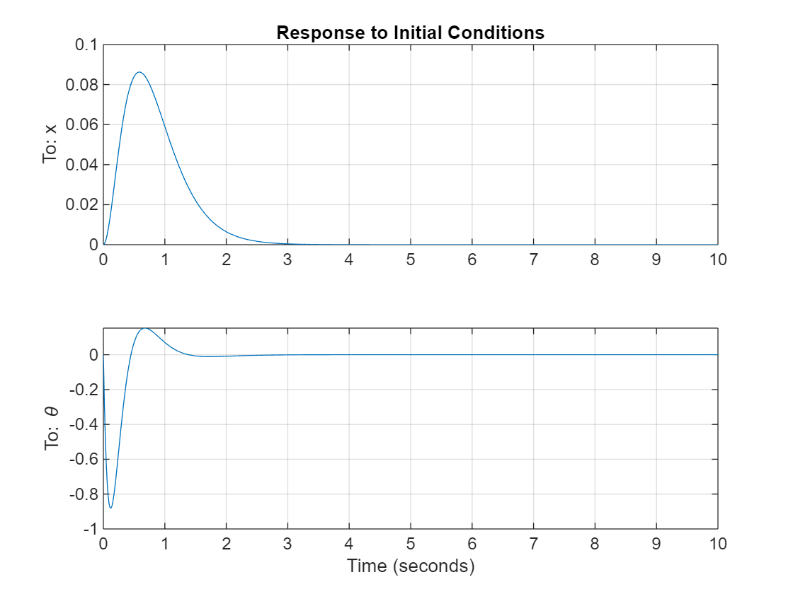

## Animation Parameters

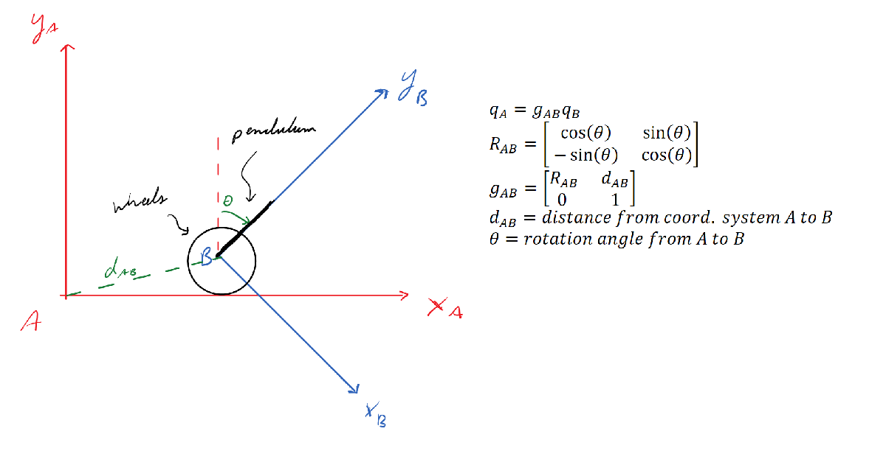

```matlab
th_wheel = linspace(0,2*pi,100);
wheel = [r_real*cos(th_wheel); r_real*sin(th_wheel) + r_real]; % the vertex locations of the "cart" (wheels)

th = linspace(0,2*pi) ; % the points for generating the plot of a circle for Center of Mass
r_CoM = 0.005; % radius of circle 2 (CoM)..?
cB = [0; l_real]; % location of the pole CoM, B-frame
eB = [0; x_bump]; % location of the END of the pole (approx. bumper CoM), B-frame 

```

## Animating the system response to initial parameters
```matlab
x = beta_state_init(:,1);
theta = beta_state_init(:,3);
figure;
cart = plot(x(1) + wheel(1,:),wheel(2,:),'r');
hold on

R_AB = [cos(theta(1)) sin(theta(1)); -sin(theta(1)) cos(theta(1))]; % rotational matrix
d_AB = [x(1); r_real]; % location of center of B-frame w.r.t. A-frame
g_AB = [R_AB d_AB; 0 0 1]; % transformation matrix
cA = g_AB*[cB; 1]; cA = cA(1:2); % pole CoM, A-frame
eA = g_AB*[eB; 1]; eA = eA(1:2); % pole end, A-frame

CoMx = cA(1) + r_CoM*cos(th) ; % Center of Mass of pole, x
CoMy = cA(2) + r_CoM*sin(th) ; % Center of Mass of pole, y

minx = min(x) - r_real; maxx = max(x) + r_real;

CoM = plot(CoMx,CoMy,'bl') ;
bar = plot([d_AB(1) eA(1)], [d_AB(2) eA(2)],'b');

fprintf("initial x value: %.5d m \ninitial theta valuue: %.5f rad",x(1),theta(1))
```

```matlabTextOutput
initial x value: 00000 m 
initial theta valuue: 0.15708 rad
```

```matlab
timestep = gradient(t_init);
%% animation
% only need half of the time steps for stability, plotting every 5th step
for i = 2:5:round(length(x)*0.5)
    wheel_draw = wheel + [repmat(x(i),[1,size(wheel,2)]); zeros(1,size(wheel,2))];
    
    R_AB = [cos(theta(i)) sin(theta(i)); -sin(theta(i)) cos(theta(i))]; % rotational matrix
    d_AB = [x(i); r_real]; % location of center of B-frame w.r.t. A-frame
    g_AB = [R_AB d_AB; 0 0 1]; % transformation matrix
    cA = g_AB*[cB; 1]; cA = cA(1:2);
    eA = g_AB*[eB; 1]; eA = eA(1:2);
    
    CoMx = cA(1) + r_CoM*cos(th); 
    CoMy = cA(2) + r_CoM*sin(th);
    bar_x = [d_AB(1) eA(1)];
    bar_y = [d_AB(2) eA(2)];

    set(cart,'XData',wheel_draw(1,:),'YData',wheel_draw(2,:)) ;
    set(CoM,'XData',CoMx,'YData',CoMy) ;
    set(bar,'XData',bar_x,'YData',bar_y) ;
    axis([minx maxx 0 (eB(2) + r_real)]*1.1)     
    drawnow
    pause(timestep(i)/4) % heuristically, calculations take non-negligible amount of time
end
```

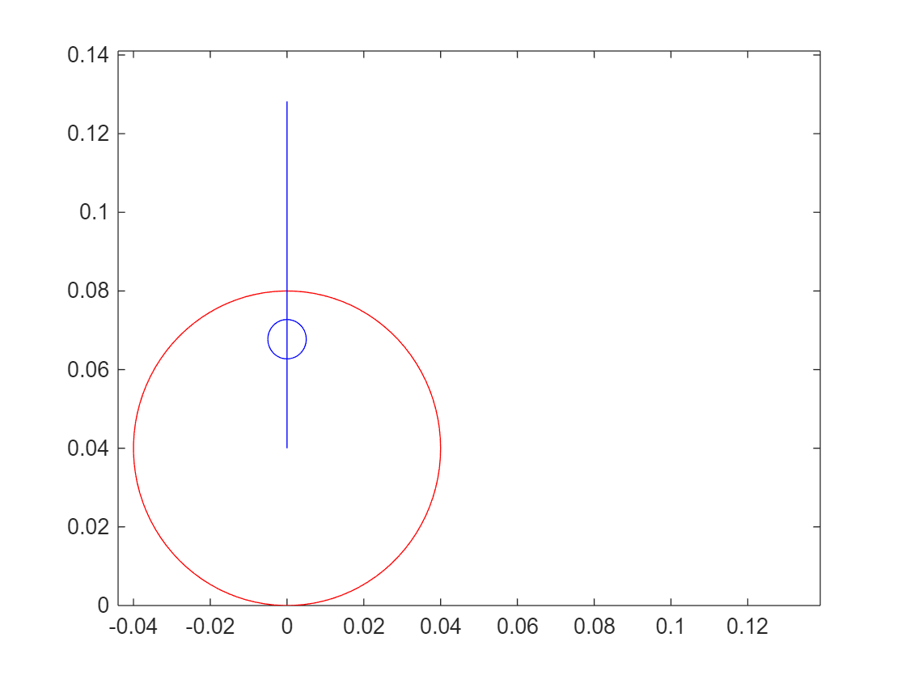

# Desired output tracking with SS Feedback P control
```matlab
yd = [1; 0]; % x position: 1m, phi: 0rad deviation
clsys_gain = -C/Abar*B % this is the gain of the system with a step input
```

```matlabTextOutput
clsys_gain = 2x1
   -1.4237
         0

```

```matlab
% from clsys_gain, we can see that phi will always return to 0, so we can
% only control the output x:
clsys_ref = yd(1)/clsys_gain(1)/10; % [m] reference input

figure;
% step response with defined input so that output is at desired location
[y_track,t_track,beta_state_track] = step(clsys*clsys_ref);
step(clsys*clsys_ref)
```

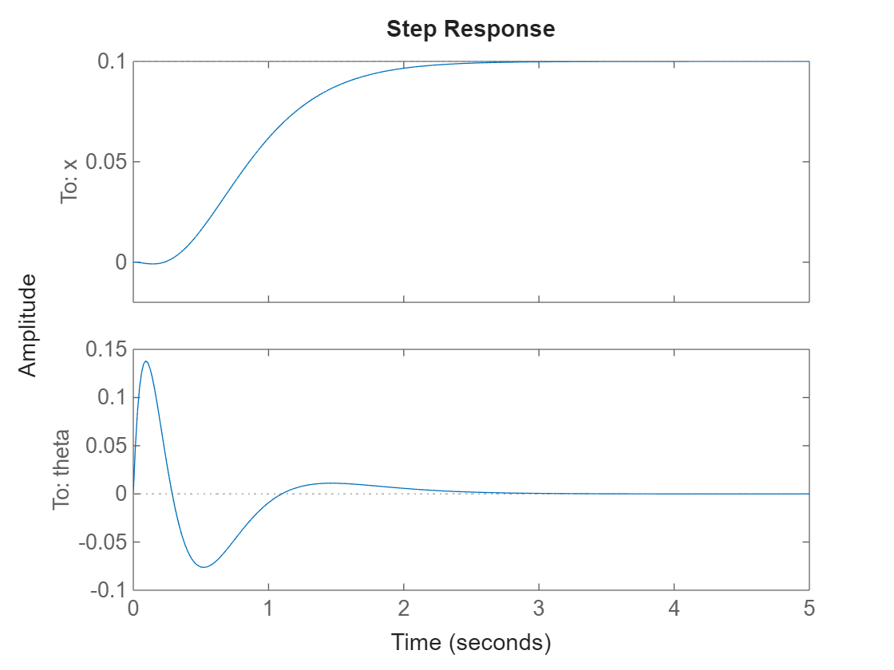

## Animating the system response to a desired output
```matlab
x = beta_state_track(:,1);
theta = beta_state_track(:,3);
figure;
cart = plot(x(1) + wheel(1,:),wheel(2,:),'r');
hold on

R_AB = [cos(theta(1)) sin(theta(1)); -sin(theta(1)) cos(theta(1))]; % rotational matrix
d_AB = [x(1); r_real]; % location of center of B-frame w.r.t. A-frame
g_AB = [R_AB d_AB; 0 0 1]; % transformation matrix
cA = g_AB*[cB; 1]; cA = cA(1:2); % pole CoM, A-frame
eA = g_AB*[eB; 1]; eA = eA(1:2); % pole end, A-frame

CoMx = cA(1) + r_CoM*cos(th) ; % Center of Mass of pole, x
CoMy = cA(2) + r_CoM*sin(th) ; % Center of Mass of pole, y

minx = min(x) - r_real; maxx = max(x) + r_real;

CoM = plot(CoMx,CoMy,'bl') ;
bar = plot([d_AB(1) eA(1)], [d_AB(2) eA(2)],'b');

fprintf("initial x value: %.5d m \ninitial theta valuue: %.5f rad",x(1),theta(1))
```

```matlabTextOutput
initial x value: 00000 m 
initial theta valuue: 0.00000 rad
```

```matlab
timestep = gradient(t_track);
%% animation
% only need half of the time steps for stability, plotting every 5th step
for i = 2:5:round(length(x)*0.5)
    wheel_draw = wheel + [repmat(x(i),[1,size(wheel,2)]); zeros(1,size(wheel,2))];
    
    R_AB = [cos(theta(i)) sin(theta(i)); -sin(theta(i)) cos(theta(i))]; % rotational matrix
    d_AB = [x(i); r_real]; % location of center of B-frame w.r.t. A-frame
    g_AB = [R_AB d_AB; 0 0 1]; % transformation matrix
    cA = g_AB*[cB; 1]; cA = cA(1:2);
    eA = g_AB*[eB; 1]; eA = eA(1:2);
    
    CoMx = cA(1) + r_CoM*cos(th); 
    CoMy = cA(2) + r_CoM*sin(th);
    bar_x = [d_AB(1) eA(1)];
    bar_y = [d_AB(2) eA(2)];

    set(cart,'XData',wheel_draw(1,:),'YData',wheel_draw(2,:)) ;
    set(CoM,'XData',CoMx,'YData',CoMy) ;
    set(bar,'XData',bar_x,'YData',bar_y) ;
    axis([minx maxx 0 (eB(2) + r_real)]*1.1)     
    drawnow
    pause(timestep(i)/2) % heuristically, calculations take non-negligible amount of time
end
```

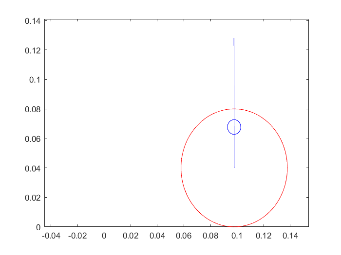

# Stabilize the System with SS Feedback PI control

With integral control, we have to define u as follows, introducing an additional state to the system since we are increasing the order of the transfer function:


 $\dot{x} =Ax+Bu$  , $y=Cx$ 

 $ u=-K_p x-K_i x_i $ 

 $ x_i =\int_0^t e~d\tau ~\,~where~e=-y_d +x $ 

yd is the desired output of the x position of the cart.


NOTE: not using integral control on the angle of the pendulum since it led to unstable control. Likely the two integrating errors were fighting each other causing an undesireable control scenario (to be looked into in the future).


Thus we have:

 $ $ \left(\begin{array}{c} \dot{x} \newline \dot{x_i }  \end{array}\right)=\left(\begin{array}{cc} (A-BK_p ) & -BK_i \newline \begin{array}{cccc} 1 & 0 & 0 & 0 \end{array} & 0
\end{array}\right)\left(\begin{array}{c} x\newline x_i  \end{array}\right)+\left(\begin{array}{c} 0\newline -y_d  \end{array}\right) $ $ 

In another representation (more intuitive for using the Bass\-Gura solution for placing the poles via the acker() or place() command):

 $ \left(\begin{array}{c} \dot{x} \newline \dot{x_i }  \end{array}\right)=\left(\begin{array}{cc} A & 0\newline C(1,:) & 0 \end{array}\right)\left(\begin{array}{c} x\newline x_i  \end{array}\right)-\left(\begin{array}{c} B\newline 0 \end{array}\right)\left(\begin{array}{cc} K_p  & K_i  \end{array}\right)\left(\begin{array}{c} x\newline x_i  \end{array}\right)+\left(\begin{array}{c} 0\newline -y_d  \end{array}\right) $ 

 $ \Rightarrow \left(\begin{array}{c} \dot{x} \newline \dot{x_i }  \end{array}\right)=\bar{A} \left(\begin{array}{c} x\newline x_i  \end{array}\right)-\bar{B} K\left(\begin{array}{c} x\newline x_i  \end{array}\right)+\left(\begin{array}{c} 0\newline -y_d  \end{array}\right) $ 

 $\Rightarrow \left(\begin{array}{c} \dot{x} \newline \dot{x_i }  \end{array}\right)=\hat{A} \left(\begin{array}{c} x\newline x_i  \end{array}\right)+\left(\begin{array}{c} 0\newline -y_d  \end{array}\right)$ , where $\hat{A} =\bar{A} -\bar{B} K$ 

```matlab
Abar = [A zeros(4,1); C(1,:) zeros(1,1)];
Bbar = [B; zeros(1,1)];
Cbar = [C zeros(2,1)];

% Location of Poles logic: 2022/10/24
% complex poles chosen along the 45deg angle so that the damping is optimal
% Real pole relative to the complex poles chosen so that the speed of the
% real pole dominates the system response.
p = [-3, -14.1*(1 + 1i*[1, -1]), -10.6*(1 + 1i*[1, -1])];
K = acker(Abar,Bbar,p)
```

```matlabTextOutput
K = 1x5
 -260.7746  -41.9353  -50.6116   -4.2663 -523.0189

```

```matlab
yd = 0.1; % [m; rad] integrating error for x only

% Closed Loop system
Ahat = Abar-Bbar*K;
Bhat = [zeros(4,1); -yd];
Chat = [C zeros(2,1)];
Dhat = zeros(2,1);
states = {'x' 'x_dot' 'theta' 'theta_dot' 'x_i'};
inputs = {'u'};
outputs = {'x'; 'theta'};
clsys_int = ss(Ahat,Bhat,Chat,Dhat,'statename',states,'inputname',inputs,'outputname',outputs)
```

```matlabTextOutput
clsys_int =
 
  A = 
                       x       x_dot       theta   theta_dot         x_i
   x                   0           1           0           0           0
   x_dot            1105       170.7       210.3       18.08        2217
   theta               0           0           0           1           0
   theta_dot  -1.364e+04       -2107       -2474      -223.1  -2.735e+04
   x_i                 1           0           0           0           0
 
  B = 
                 u
   x             0
   x_dot         0
   theta         0
   theta_dot     0
   x_i        -0.1
 
  C = 
                  x      x_dot      theta  theta_dot        x_i
   x              1          0          0          0          0
   theta          0          0          0          1          0
 
  D = 
          u
   x      0
   theta  0
 
Continuous-time state-space model.
Model Properties
```

```matlab
clsys_int_tf = tf(clsys_int)
```

```matlabTextOutput
clsys_int_tf =
 
  From input "u" to output...
                     -221.7 s^2 + 1.063e-11 s + 2.681e04
   x:  ----------------------------------------------------------------
       s^5 + 52.4 s^4 + 1368 s^3 + 1.843e04 s^2 + 1.337e05 s + 2.681e05
 
                  2735 s^3 - 3.065e-12 s^2 + 6.893e-10 s - 1.894e-40
   theta:  ----------------------------------------------------------------
           s^5 + 52.4 s^4 + 1368 s^3 + 1.843e04 s^2 + 1.337e05 s + 2.681e05
 
Continuous-time transfer function.
Model Properties
```

```matlab
[y_int_init,t_int_init,beta_state_int_init] = initial(clsys_int,[0; 0 ; pi/20; 0; 0],3);
figure;
tiledlayout(2,1);
nexttile;
plot(t_int_init, y_int_init(:,1)); title('Response to Initial Conditions'); ylabel('To: x');
grid on
nexttile;
plot(t_int_init,y_int_init(:,2)); ylabel('To: \theta'); xlabel('Time (seconds)')
grid on
```

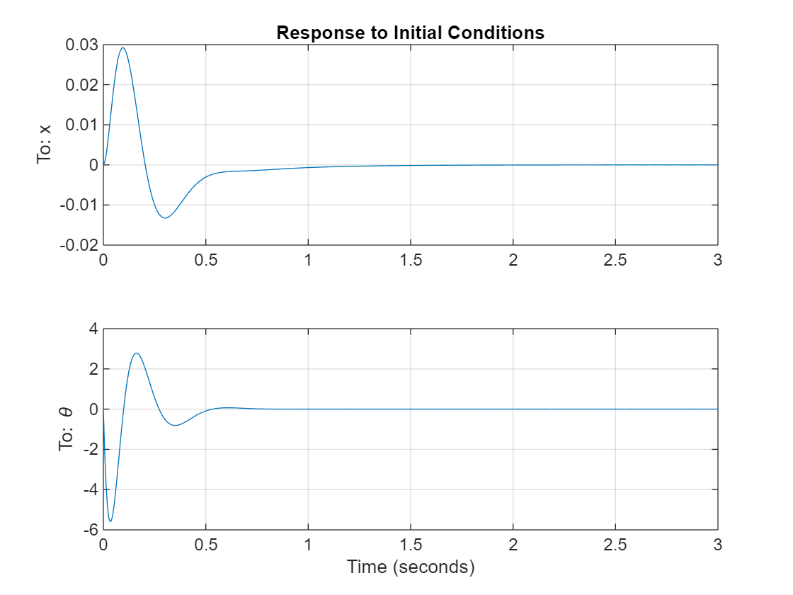

```matlab
figure;
u = -K*beta_state_int_init';
plot(t_int_init,u)
```

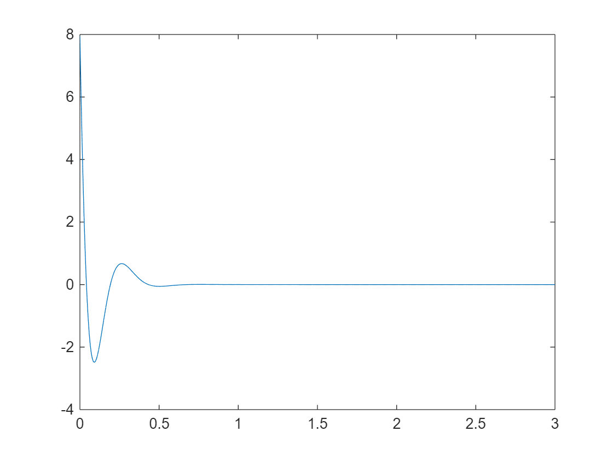

```matlab

% Step Response of Integrator
figure;
[y_int_track,t_int_track,beta_state_int_track] = step(clsys_int);
step(clsys_int)
```

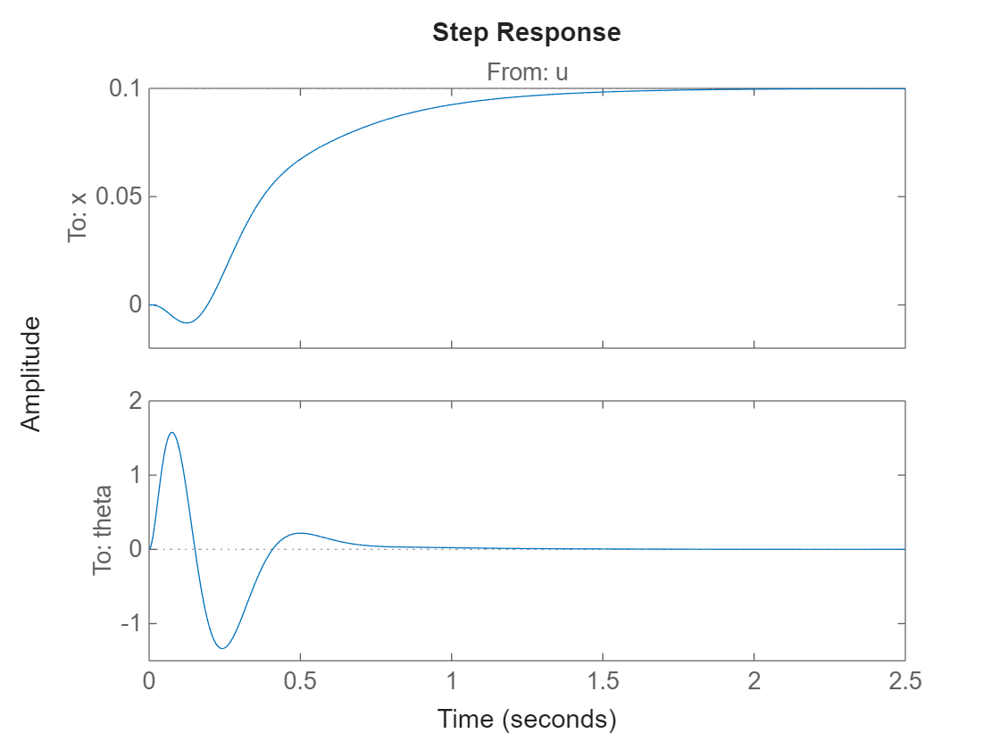


## Animating the system response to a desired output
```matlab
x = beta_state_int_track(:,1);
theta = beta_state_int_track(:,3);
figure;
cart = plot(x(1) + wheel(1,:),wheel(2,:),'r');
hold on

R_AB = [cos(theta(1)) sin(theta(1)); -sin(theta(1)) cos(theta(1))]; % rotational matrix
d_AB = [x(1); r_real]; % location of center of B-frame w.r.t. A-frame
g_AB = [R_AB d_AB; 0 0 1]; % transformation matrix
cA = g_AB*[cB; 1]; cA = cA(1:2); % pole CoM, A-frame
eA = g_AB*[eB; 1]; eA = eA(1:2); % pole end, A-frame

CoMx = cA(1) + r_CoM*cos(th) ; % Center of Mass of pole, x
CoMy = cA(2) + r_CoM*sin(th) ; % Center of Mass of pole, y

minx = min(x) - r_real; maxx = max(x) + r_real;

CoM = plot(CoMx,CoMy,'bl') ;
bar = plot([d_AB(1) eA(1)], [d_AB(2) eA(2)],'b');

fprintf("initial x value: %.5d m \ninitial theta valuue: %.5f rad",x(1),theta(1))
```

```matlabTextOutput
initial x value: 00000 m 
initial theta valuue: 0.00000 rad
```

```matlab
timestep = gradient(t_int_track);
%% animation
% plotting every 5th step
for i = 2:5:round(length(x))
    wheel_draw = wheel + [repmat(x(i),[1,size(wheel,2)]); zeros(1,size(wheel,2))];
    
    R_AB = [cos(theta(i)) sin(theta(i)); -sin(theta(i)) cos(theta(i))]; % rotational matrix
    d_AB = [x(i); r_real]; % location of center of B-frame w.r.t. A-frame
    g_AB = [R_AB d_AB; 0 0 1]; % transformation matrix
    cA = g_AB*[cB; 1]; cA = cA(1:2);
    eA = g_AB*[eB; 1]; eA = eA(1:2);
    
    CoMx = cA(1) + r_CoM*cos(th); 
    CoMy = cA(2) + r_CoM*sin(th);
    bar_x = [d_AB(1) eA(1)];
    bar_y = [d_AB(2) eA(2)];

    set(cart,'XData',wheel_draw(1,:),'YData',wheel_draw(2,:)) ;
    set(CoM,'XData',CoMx,'YData',CoMy) ;
    set(bar,'XData',bar_x,'YData',bar_y) ;
    axis([minx maxx 0 (eB(2) + r_real)]*1.1)     
    drawnow
    pause(timestep(i)/2) % heuristically, calculations take non-negligible amount of time
end
```

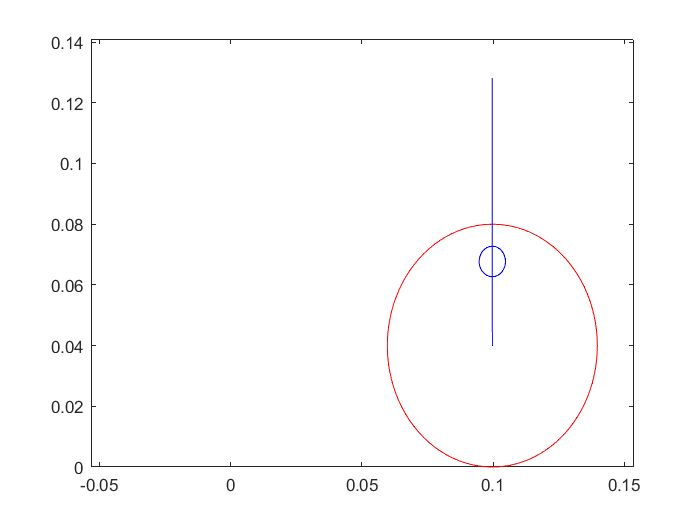

# Stabilize System with Luenberger Observer Feedback & PI Control
## Theory:

With integral control, we have to define u as follows, introducing an additional state to the system since we are increasing the order of the transfer function:


Plant: $\dot{x} =Ax+Bu$  , $y=Cx$ 


Observer: $\dot{\hat{x} } =A\hat{x} +Bu+L(y-C\hat{x} )$ 


Controller: 

 $ u=-K_s \hat{x} -K_i x_i $ 

 $ x_i =\int_0^t e~d\tau ~\,~where~e=y_d -C_2 \hat{y} $ 

Diagram:


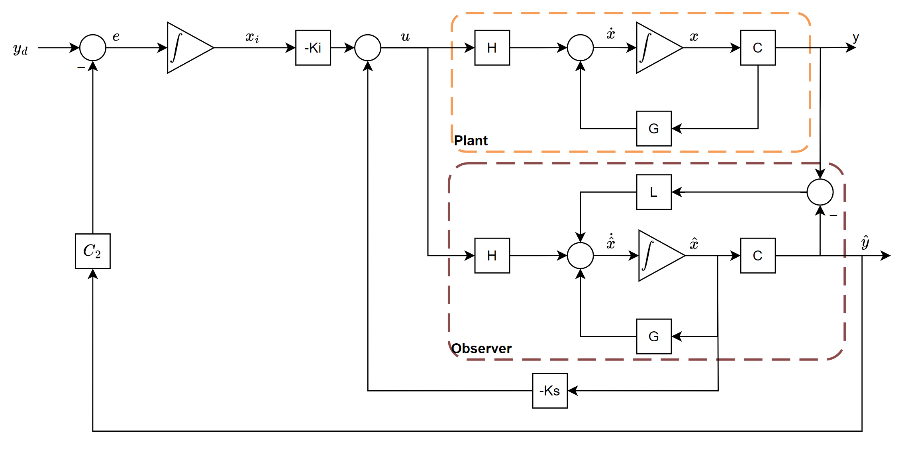


NOTE: since we only care about controlling for the x\-position of the cart, the $y_d$ in the diagram above is only $x_d (1)$ and $C_2 \hat{y} =C_2 C\hat{x} =\left\lbrack \begin{array}{cccc} 1 & 0 & 0 & 0 \end{array}\right\rbrack \hat{x}$ 


Controller Subsystem:

&nbsp;&nbsp;&nbsp;&nbsp; $ \dot{x} =Ax+B(-K_s \hat{x} -K_i x_i ) $ 

&nbsp;&nbsp;&nbsp;&nbsp; note: $\tilde{x} =x-\hat{x} \Rightarrow \hat{x} =x-\tilde{x}$ 

&nbsp;&nbsp;&nbsp;&nbsp; $ \Rightarrow \dot{x} =Ax+B(-K_s (x-\tilde{x} )-K_i x_i )=(A-BK_s )x+BK_s \tilde{x} -BK_i x_i $ 

Observer Subsystem:

&nbsp;&nbsp;&nbsp;&nbsp; $ \dot{\hat{x} } =A\hat{x} +Bu+L(y-C\hat{x} ) $ 

&nbsp;&nbsp;&nbsp;&nbsp; note: 

&nbsp;&nbsp;&nbsp;&nbsp; $ \dot{\tilde{x} } =\dot{x} -\dot{\hat{x} } =Ax+Bu-A\hat{x} -Bu-L(y-C\hat{x} )=A\tilde{x} -L(Cx-C\hat{x} ) $ 

&nbsp;&nbsp;&nbsp;&nbsp; $ \Rightarrow \dot{\tilde{x} } =(A-LC)\tilde{x} $ 

Integral Subsystem:

&nbsp;&nbsp;&nbsp;&nbsp; $ {\dot{x} }_i =e=y_d -C_2 \hat{y} =y_d -C_2 C\hat{x} =y_d -C^{\prime } x+C^{\prime } \tilde{x} $ 

&nbsp;&nbsp;&nbsp;&nbsp; where $C_2 C=C^{\prime }$ 


Overall Closed Loop System:

&nbsp;&nbsp;&nbsp;&nbsp; $ \left\lbrack \begin{array}{c} \dot{x} \newline {\dot{x} }_i \newline \dot{\tilde{x} }  \end{array}\right\rbrack =\left\lbrack \begin{array}{ccc} A-BK_s  & -BK_i  & BK_s \newline -C^{\prime }  & 0 & C^{\prime } \newline 0 & 0 & A-LC \end{array}\right\rbrack \left\lbrack \begin{array}{c} x\newline x_i \newline \tilde{x}  \end{array}\right\rbrack +\left\lbrack \begin{array}{c} 0\newline y_d \newline 0 \end{array}\right\rbrack $ 

&nbsp;&nbsp;&nbsp;&nbsp;&nbsp;&nbsp;&nbsp;&nbsp;&nbsp;&nbsp;&nbsp;&nbsp; $ =\left\lbrack \begin{array}{ccc} A & 0 & 0\newline -C^{\prime }  & 0 & C^{\prime } \newline 0 & 0 & A-LC \end{array}\right\rbrack \left\lbrack \begin{array}{c} x\newline x_i \newline \tilde{x}  \end{array}\right\rbrack -\left\lbrack \begin{array}{c} B\newline 0\newline 0 \end{array}\right\rbrack \left\lbrack \begin{array}{ccc} K_s  & K_i  & -K_s  \end{array}\right\rbrack \left\lbrack \begin{array}{c} x\newline x_i \newline \tilde{x}  \end{array}\right\rbrack +\left\lbrack \begin{array}{c} 0\newline y_d \newline 0 \end{array}\right\rbrack $ 

&nbsp;&nbsp;&nbsp;&nbsp; where we let:


&nbsp;&nbsp;&nbsp;&nbsp;&nbsp; $\bar{A} =\left\lbrack \begin{array}{cc} A & 0\newline -C^{\prime }  & 0 \end{array}\right\rbrack$ , $\bar{B} =\left\lbrack \begin{array}{c} B\newline 0 \end{array}\right\rbrack$ , $K=\left\lbrack \begin{array}{cc} K_s  & K_i  \end{array}\right\rbrack$ 


Separation Principle:

-  The eigenvalues of the overall closed loop system are the **union** of the eigenvalues of the two subsystems:  
-  1. $\bar{A} -\bar{B} K$ (i.e. closed loop poles) 
-  2. A \- LC (i.e. observer poles) 

&nbsp;&nbsp;&nbsp;&nbsp; By designing the location of the closed loop poles and the observer poles independently, we can still achieve a stable system with the desired performance.


&nbsp;&nbsp;&nbsp;&nbsp; e.g. K = acker(Abar,Bbar,pd\_control) and L = place(A',C',pd\_observer)

## Implementation:
```matlab
% desired close-loop pole locations:
pc_control = [-3, -4, -5, -6, -7]; % add one pole for integral state
pc_observer = [-20,-21,-22,-23]*2;

C2 = [1 0];
Cprime = C2*C;
Abar = [A, zeros(4,1); -Cprime, 0];
Bbar = [B; 0];
K = acker(Abar, Bbar, pc_control), Ks = K(1:end-1); Ki = K(end);
```

```matlabTextOutput
K = 1x5
   -5.3733   -3.9894   -8.4326   -0.6671    4.9168

```

```matlab
L = place(A',C',pc_observer)'
```

```matlabTextOutput
L = 4x2
1.0e+03 *

    0.0767   -0.0004
1.2917   -0.0163
   -0.8192    0.0208
   -0.3842    0.0883

```

```matlab
yd = 0.5; % [m] desired x-position
Aobs = A - L*C;
Acl = [Abar - Bbar*K, [B*Ks; Cprime];
       zeros(4,5), Aobs];
eig(Acl)' % confirming eigenvalues of closed loop system are as desired
```

```matlabTextOutput
ans = 1x9
   -7.0000   -6.0000   -5.0000   -4.0000   -3.0000  -40.0000  -42.0000  -46.0000  -44.0000

```

```matlab
Bcl = [zeros(4,1); yd; zeros(4,1)];
Ccl = [C, zeros(2,5)];
Dcl = D;
states = {'x' 'x_dot' '\theta' '\theta dot' 'integral' 'x_err' 'x_dot_err' '\theta_err' '\theta_dot_err'};
inputs = {'u'};
outputs = {'x'; '\theta dot'};
clsys = ss(Acl, Bcl, Ccl, Dcl,...
    'statename',states,'inputname',inputs,'outputname',outputs);
[~,tOut,xstep] = step(clsys);
t = myplot2(tOut,xstep);
title(t, {" !!!EQ_59!!! "; "From: u"}, 'Interpreter', 'Latex')
```

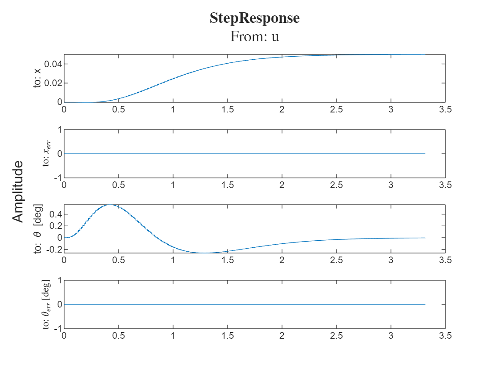

```matlab
figure; % control effort
u = -Ks*(xstep(:,1:4) - xstep(:,6:9))' - Ki*xstep(:,5)';
stairs(tOut,u)
ylabel('Newtons')
title('Control Effort')
```

NOTE: in order to simulate the system correctly, I needed to setup the initial error of the system. On a real system, we'd only have the initial error from the measured states \- obtained via the observations.

```matlab
figure;
x0 = [0.5; 0; 5*pi/180; 1*pi/180; 0];
x0err = [x0(1); 0; 0; x0(4)]; % assume we measure x and theta_dot
xinit = [x0; x0err];
[~,~,xlsim] = lsim(clsys,ones(size(tOut)),tOut,xinit);
t2 = myplot2(tOut,xlsim);
title(t2, {" $\bf I.C.\ Response$ "; "From: u"}, 'Interpreter', 'Latex')
```

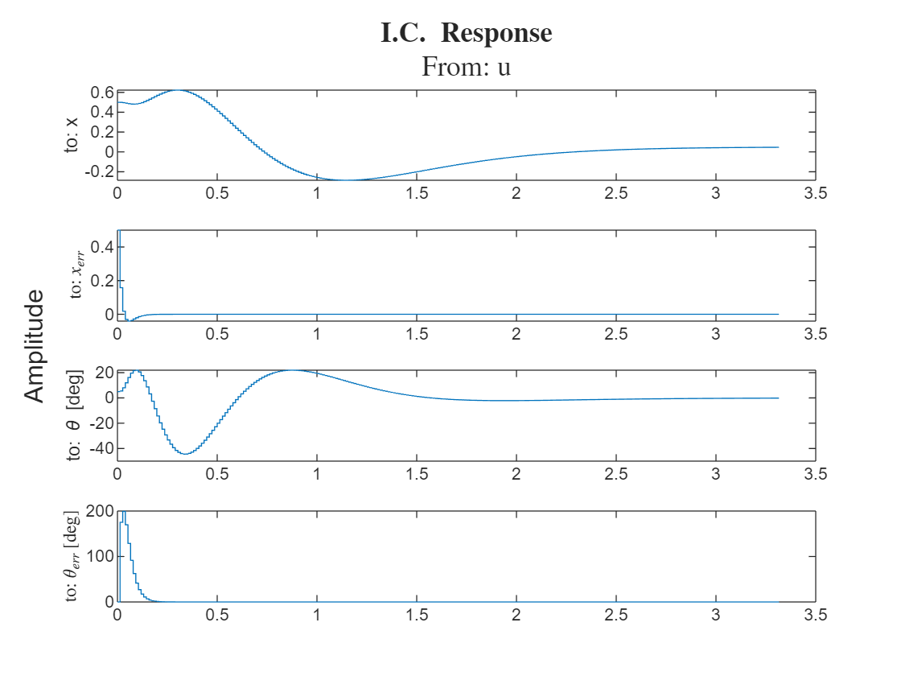

```matlab
figure; % control effort
u = -Ks*(xlsim(:,1:4) - xlsim(:,6:9))' - Ki*xlsim(:,5)';
stairs(tOut,u)
ylabel('Newtons')
title('Control Effort')
```

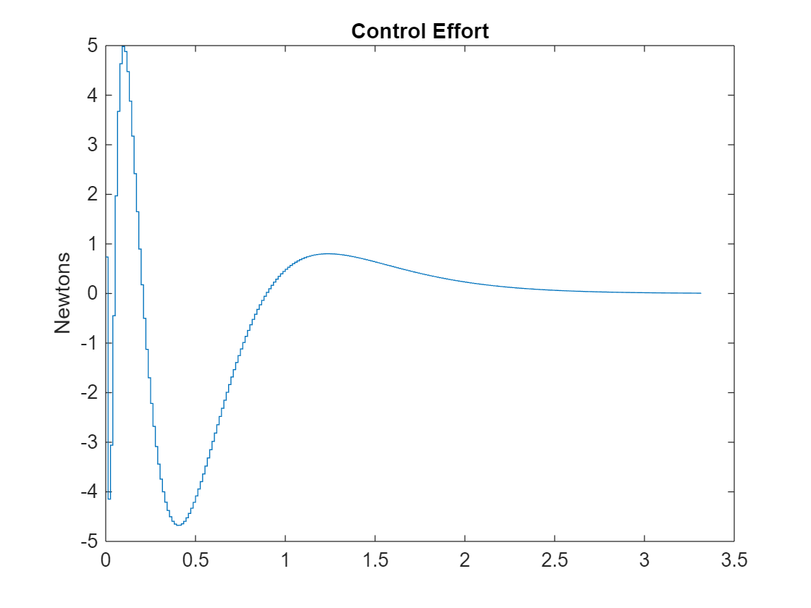

```matlab

figure;
t3 = tiledlayout(4,1);
title(t3,'Error Response')
ylabel(t3, 'Amplitude')
nexttile;
stairs(tOut,xlsim(:,6));
ylabel('to:  !!!EQ_61!!! ','Interpreter','latex');
nexttile;
stairs(tOut,xlsim(:,7));
ylabel('to:  !!!EQ_62!!! ','Interpreter','latex');
nexttile;
stairs(tOut,xlsim(:,8));
ylabel('to:  !!!EQ_63!!! ','Interpreter','latex');
nexttile;
stairs(tOut,xlsim(:,9));
ylabel('to:  !!!EQ_64!!! ','Interpreter','latex');
```

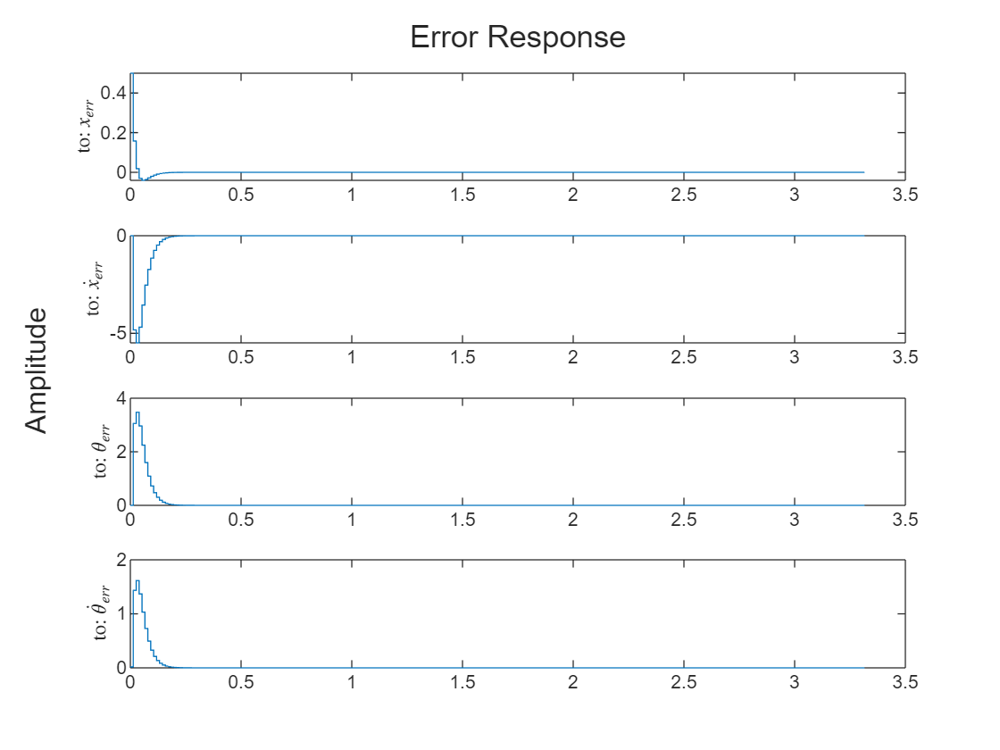

NEXT STEPS:

-  Substitute in real values (estimated) \- DONE 
-  get the integral control working, \- DONE 
-  Optimal control 
-  discretize the control solutions (state space, integral, optimal) 
-  Start coding into arduino and test; tune values as needed 
-  (? then do an optimal control solution ?) 
-  
