# Cart\-Pole Discrete Control
<a name="beginToc"></a>

## Table of Contents
&emsp;[State Space Representation](#state-space-representation)
 
&emsp;[Discretization](#discretization)
 
&emsp;[Stabilize System with SS Feedback P Control; Discrete](#stabilize-system-with-ss-feedback-p-control-discrete)
 
&emsp;[Stabilize System with SS Feedback PI Control; Discrete](#stabilize-system-with-ss-feedback-pi-control-discrete)
 
&emsp;&emsp;[Theory:](#theory-)
 
&emsp;&emsp;[Implementation:](#implementation-)
 
&emsp;[Stabilize System with Luenberger Observer Feedback & Proportional Control; Discrete](#stabilize-system-with-luenberger-observer-feedback-discrete)
 
&emsp;&emsp;[Theory:](#theory-)
 
&emsp;&emsp;[Implementation:](#implementation-)
 
&emsp;[Stabilize System with Luenberger Observer Feedback & PI Control; Discrete](#stabilize-system-with-luenberger-observer-feedback-discrete)
 
&emsp;&emsp;[Theory:](#theory-)
 
&emsp;&emsp;[Implementation:](#implementation-)
 
<a name="endToc"></a>

# State Space Representation

See "wheeled\_balancer\_model\_eqtns.mlx" and "wheeled\_balancer\_model.mlx" for derivation of equations of motion and real values of system parameters.

```matlab
% outputting both the x-position and theta-angle
A = [0    1.0000         0         0
         0   -7.0198   -4.2395         0
         0         0         0    1.0000
         0   86.6165  173.2330         0];
B =[0
    4.2385
         0
  -52.2983];
C = [1 0 0 0; 0 0 0 1];
D = [0;0];
states = {'x' 'x_dot' 'theta' 'theta_dot'};
inputs = {'u'};
outputs = {'x'; 'theta_dot'};
cplant = ss(A,B,C,D,'statename',states,'inputname',inputs,'outputname',outputs)
```

```matlabTextOutput
cplant =
 
  A = 
                      x      x_dot      theta  theta_dot
   x                  0          1          0          0
   x_dot              0      -7.02     -4.239          0
   theta              0          0          0          1
   theta_dot          0      86.62      173.2          0
 
  B = 
                  u
   x              0
   x_dot      4.239
   theta          0
   theta_dot  -52.3
 
  C = 
                      x      x_dot      theta  theta_dot
   x                  1          0          0          0
   theta_dot          0          0          0          1
 
  D = 
              u
   x          0
   theta_dot  0
 
Continuous-time state-space model.
Model Properties
```

# Discretization
```matlab
T = 1/100; % 0.01s, 100Hz
plant = c2d(cplant,T);
[G, H, Cd, Dd] = ssdata(plant)
```

```matlabTextOutput
G = 4x4
1.0000    0.0097   -0.0002   -0.0000
         0    0.9322   -0.0411   -0.0002
         0    0.0042    1.0086    0.0100
         0    0.8389    1.7193    1.0086

H = 4x1
    0.0002
    0.0410
   -0.0026
   -0.5065

Cd = 2x4
     1     0     0     0
     0     0     0     1

Dd = 2x1
     0
     0

```

# Stabilize System with SS Feedback P Control; Discrete
```matlab
% contrallability/observability
rank(ctrb(G,H)), rank(obsv(G,Cd))
```

```matlabTextOutput
ans = 4
ans = 4
```

```matlab

% desired close-loop pole locations:
pc = [-3, -4, -6, -10];
pd = exp(T*pc);

% Feedback controller
K = acker(G,H,pd);

% Closed-loop system
states = {'x' 'x_dot' 'theta' 'theta_dot'};
inputs = {'u'};
outputs = {'x'; 'theta_dot'};
clsys = ss(G-H*K, H, Cd, Dd, T, ...
    'statename',states,'inputname',inputs,'outputname',outputs);
step(clsys)
```

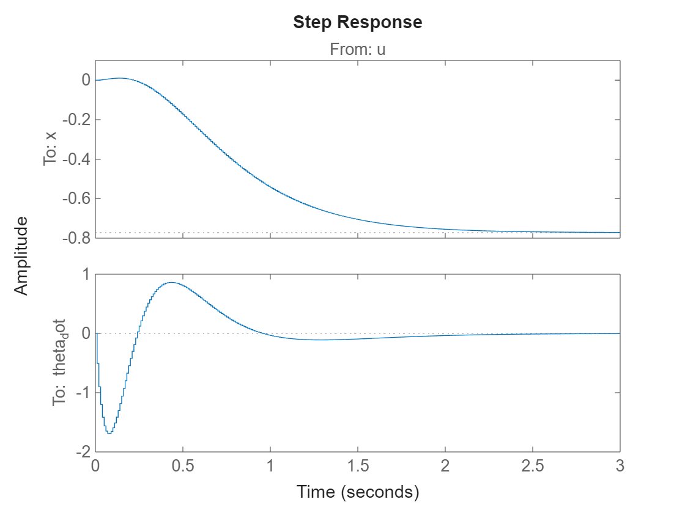

```matlab
figure;
gain = Cd*(eye(4) - (G - H*K))^(-1)*H
```

```matlabTextOutput
gain = 2x1
   -0.7718
   -0.0000

```

```matlab
step(clsys/gain(1))
```

# Stabilize System with SS Feedback PI Control; Discrete
## Theory:

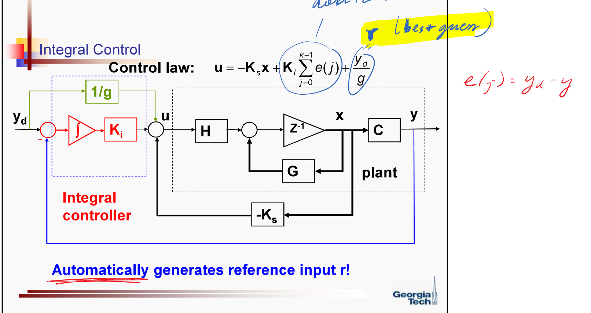


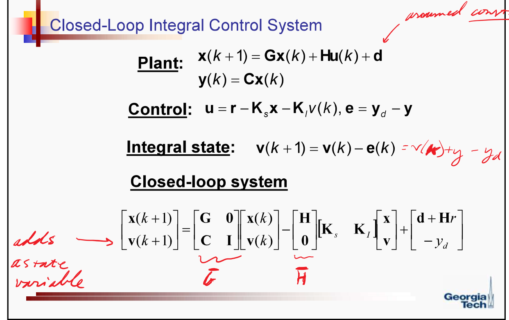


instead of \-yd at the end though, defining v(k+1) = v(k) + e(k) so that we invert the signs of yd and C

## Implementation:
```matlab
Gbar = [G zeros(4,1); -Cd(1,:) 1]
```

```matlabTextOutput
Gbar = 5x5
1.0000    0.0097   -0.0002   -0.0000         0
         0    0.9322   -0.0411   -0.0002         0
         0    0.0042    1.0086    0.0100         0
         0    0.8389    1.7193    1.0086         0
   -1.0000         0         0         0    1.0000

```

```matlab
Hbar = [H; 0]
```

```matlabTextOutput
Hbar = 5x1
    0.0002
    0.0410
   -0.0026
   -0.5065
         0

```

```matlab
% desired close-loop pole locations:
pc = [-3, -4, -6, -9, -10];
pd = exp(T*pc)
```

```matlabTextOutput
pd = 1x5
    0.9704    0.9608    0.9418    0.9139    0.9048

```

```matlab
K = acker(Gbar, Hbar, pd)
```

```matlabTextOutput
K = 1x5
  -10.8317   -5.7073  -11.0581   -0.9188    0.1115

```

```matlab
Gcl = Gbar - Hbar*K
```

```matlabTextOutput
Gcl = 5x5
1.0022    0.0108    0.0021    0.0002   -0.0000
    0.4437    1.1660    0.4120    0.0374   -0.0046
   -0.0277   -0.0104    0.9803    0.0077    0.0003
   -5.4865   -2.0520   -3.8819    0.5432    0.0565
   -1.0000         0         0         0    1.0000

```

```matlab
yd = 0.5; r = 0; 
% r is 0 because the error (yd - y) automatically generates the reference input
states = {'x' 'x_dot' 'theta' 'theta_dot' 'integral'};
inputs = {'u'};
outputs = {'x'; '\theta dot';'u'};
clsys = ss(Gcl, [H*r; yd],[Cd [0;0]; -K],[Dd; 0],T,...
    'statename',states,'inputname',inputs,'outputname',outputs);
step(clsys)
```

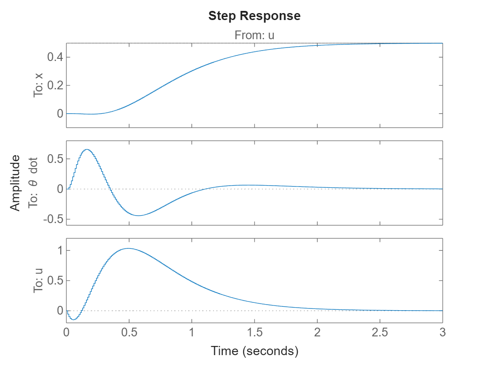

# Stabilize System with Luenberger Observer Feedback & Proportional Control; Discrete
## Theory:

Combined Controller\-Observer Formulation:


Plant:   $x^+ =Gx+Hu$ ,  $y=Cx$ 


Controller: $u=-K\hat{x} +r$ 


Observer: ${\hat{x} }^+ =G\hat{x} +Hu+L(y-C\hat{x} )$ 


Diagram:


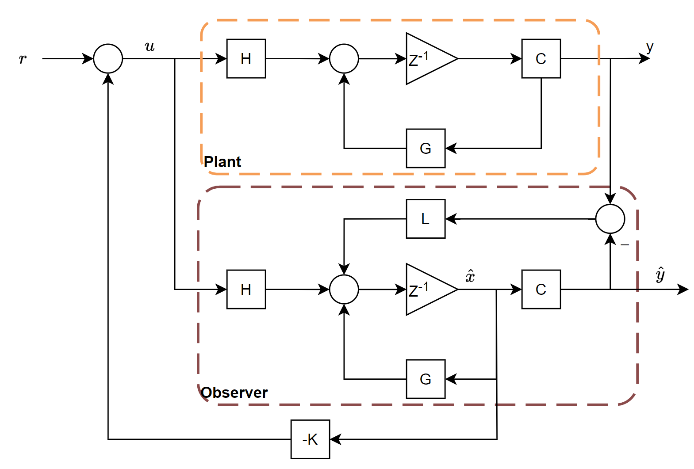


Closed\-Loop System:


Controller Subsystem:

&nbsp;&nbsp;&nbsp;&nbsp; $ x^+ =Gx+H(-K\hat{x} +r) $ 

&nbsp;&nbsp;&nbsp;&nbsp; note: $\tilde{x} =x-\hat{x} \Rightarrow \hat{x} =x-\tilde{x}$ 

&nbsp;&nbsp;&nbsp;&nbsp; $ \Rightarrow x^+ =Gx+H(-K(x-\tilde{x} )+r)=(G-HK)x-HK\tilde{x} +Hr $ 

Observer Subsystem:

&nbsp;&nbsp;&nbsp;&nbsp; $ {\hat{x} }^+ =G\hat{x} +Hu+L(y-C\hat{x} ) $ 

&nbsp;&nbsp;&nbsp;&nbsp; note: 

&nbsp;&nbsp;&nbsp;&nbsp; $ {\tilde{x} }^+ =x^+ -{\hat{x} }^+ =Gx+Hu-G\hat{x} -Hu-L(y-C\hat{x} )=G\tilde{x} -L(Cx-C\hat{x} ) $ 

&nbsp;&nbsp;&nbsp;&nbsp; $ \Rightarrow {\tilde{x} }^+ =(G-LC)\tilde{x} $ 

Overall Closed Loop System:

&nbsp;&nbsp;&nbsp;&nbsp; $ {\left\lbrack \begin{array}{c} x\newline \tilde{x}  \end{array}\right\rbrack }^+ =\left\lbrack \begin{array}{cc} G-HK & -HK\newline 0 & G-LC \end{array}\right\rbrack \left\lbrack \begin{array}{c} x\newline \tilde{x}  \end{array}\right\rbrack +\left\lbrack \begin{array}{c} H\newline 0 \end{array}\right\rbrack r $ 

Separation Principle:

-  The eigenvalues of the overall closed loop system are the **union** of the eigenvalues of the two subsystems:  
-  1. G \- HK (i.e. closed loop poles) 
-  2. G \- LC (i.e. observer poles) 

&nbsp;&nbsp;&nbsp;&nbsp; By designing the location of the closed loop poles and the observer poles independently, we can still achieve a stable system with the desired performance.


&nbsp;&nbsp;&nbsp;&nbsp; e.g. K = acker(G,H,pd\_control) and L = place(G',C',pd\_observer)

## Implementation:
```matlab
% desired close-loop pole locations:
pc_control = [-3, -4, -5, -6];
pd_control = exp(T*pc_control)
```

```matlabTextOutput
pd_control = 1x4
    0.9704    0.9608    0.9512    0.9418

```

```matlab
pc_observer = [-20,-21,-22,-23]*2;
pd_observer = exp(T*pc_observer)
```

```matlabTextOutput
pd_observer = 1x4
    0.6703    0.6570    0.6440    0.6313

```

```matlab

K = acker(G, H, pd_control);
L = place(G',Cd',pd_observer)';

Gcl = G - H*K;
Gobs = G - L*Cd;
Acl = [Gcl, -H*K; zeros(4,4), Gobs];
eig(Acl)
```

```matlabTextOutput
ans = 8x1
    0.9418
    0.9512
    0.9608
    0.9704
    0.6703
    0.6570
    0.6313
    0.6440

```

```matlab
Bcl = [H; zeros(4,1)];
Ccl = [Cd, zeros(2,4)];
Dcl = Dd;
states = {'x' 'x_dot' '\theta' '\theta dot' 'x_hat_err' 'x_dot_hat_err' '\theta_hat_err' '\theta_dot_hat_err'};
inputs = {'u'};
outputs = {'x'; '\theta dot'};
clsys = ss(Acl, Bcl, Ccl, Dcl, T,...
    'statename',states,'inputname',inputs,'outputname',outputs);
[~,tOut,x] = step(clsys);
t = myplot(tOut,x);
title(t, {" !!!EQ_18!!! "; "From: u"}, 'Interpreter', 'Latex')
```

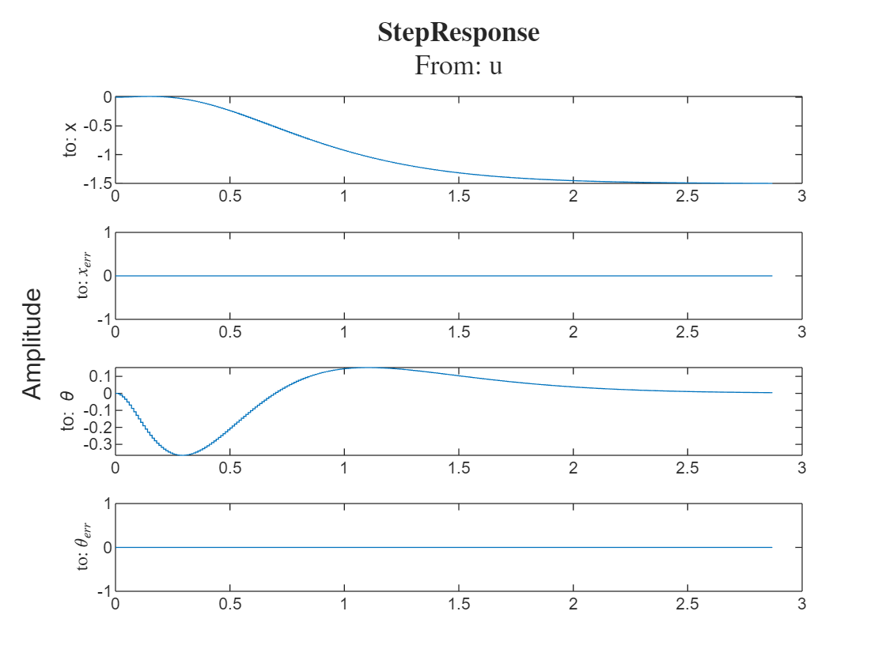

```matlab
figure;
```

NOTE: in order to simulate the system correctly, I needed to setup the initial error of the system. On a real system, we'd only have the initial error from the measured states \- obtained via the observations.

```matlab
x0 = [0.5; 0; 5*pi/180; 1*pi/180];
x0err = [x0(1); 0; 0; x0(4)];
xinit = [x0; x0err];
[~,~,xlsim] = lsim(clsys,ones(size(tOut)),tOut,xinit);
t2 = myplot(tOut,xlsim);
title(t2, {" $\bf I.C.\ Response$ "; "From: u"}, 'Interpreter', 'Latex')
```

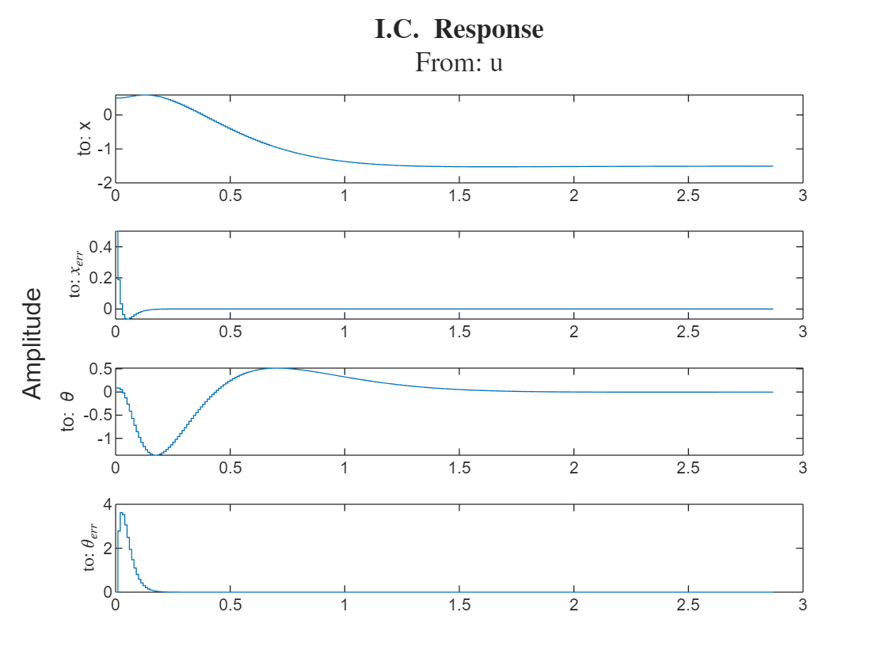

```matlab

figure;
t3 = tiledlayout(4,1);
title(t3,'Error Response')
ylabel(t3, 'Amplitude')
nexttile;
stairs(tOut,xlsim(:,5));
ylabel('to:  !!!EQ_20!!! ','Interpreter','latex');
nexttile;
stairs(tOut,xlsim(:,6));
ylabel('to:  !!!EQ_21!!! ','Interpreter','latex');
nexttile;
stairs(tOut,xlsim(:,7));
ylabel('to:  !!!EQ_22!!! ','Interpreter','latex');
nexttile;
stairs(tOut,xlsim(:,8));
ylabel('to:  !!!EQ_23!!! ','Interpreter','latex');
```

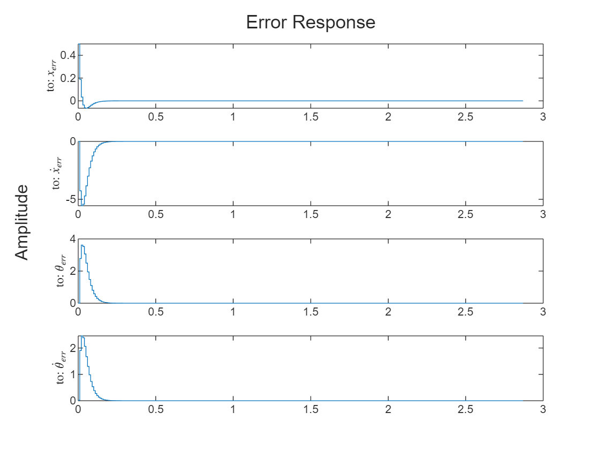

# Stabilize System with Luenberger Observer Feedback & PI Control; Discrete
## Theory:

Combined Controller\-Observer Formulation:


Plant:   $x^+ =Gx+Hu$ ,  $y=Cx$ 


Observer: ${\hat{x} }^+ =G\hat{x} +Hu+L(y-C\hat{x} )$ 


Controller: 

&nbsp;&nbsp;&nbsp;&nbsp; $ u=-K_s \hat{x} -K_i v $ 

&nbsp;&nbsp;&nbsp;&nbsp; $ v^+ =v+e $ 

&nbsp;&nbsp;&nbsp;&nbsp; $ e=y_d -C_2 \hat{y} $ 

Diagram:


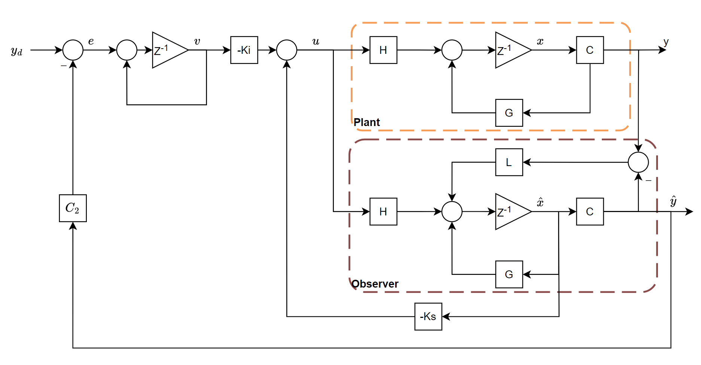


NOTE: since we only care about controlling for the x\-position of the cart, the $y_d$ in the diagram above is only $x_d$ and $C_2 \hat{y} =C_2 C\hat{x} =\left\lbrack \begin{array}{cccc} 1 & 0 & 0 & 0 \end{array}\right\rbrack \hat{x}$ 


Closed\-Loop System:


Controller Subsystem:

&nbsp;&nbsp;&nbsp;&nbsp; $ x^+ =Gx+H(-K_s \hat{x} -K_i v) $ 

&nbsp;&nbsp;&nbsp;&nbsp; note: $\tilde{x} =x-\hat{x} \Rightarrow \hat{x} =x-\tilde{x}$ 

&nbsp;&nbsp;&nbsp;&nbsp; $ \Rightarrow x^+ =Gx+H(-K_s (x-\tilde{x} )-K_i v)=(G-HK_s )x+HK_s \tilde{x} -HK_i v $ 

Observer Subsystem:

&nbsp;&nbsp;&nbsp;&nbsp; $ {\hat{x} }^+ =G\hat{x} +Hu+L(y-C\hat{x} ) $ 

&nbsp;&nbsp;&nbsp;&nbsp; note: 

&nbsp;&nbsp;&nbsp;&nbsp; $ {\tilde{x} }^+ =x^+ -{\hat{x} }^+ =Gx+Hu-G\hat{x} -Hu-L(y-C\hat{x} )=G\tilde{x} -L(Cx-C\hat{x} ) $ 

&nbsp;&nbsp;&nbsp;&nbsp; $ \Rightarrow {\tilde{x} }^+ =(G-LC)\tilde{x} $ 

Integral Subsystem:

&nbsp;&nbsp;&nbsp;&nbsp; $ v^+ =v+y_d -C_2 C\hat{x} =v-C^{\prime } x+C^{\prime } \tilde{x} +y_d $ 

&nbsp;&nbsp;&nbsp;&nbsp; where $C_2 C=C^{\prime }$ 


Overall Closed Loop System:

&nbsp;&nbsp;&nbsp;&nbsp; $ {\left\lbrack \begin{array}{c} x\newline v\newline \tilde{x}  \end{array}\right\rbrack }^+ =\left\lbrack \begin{array}{ccc} G-HK_s  & -HK_i  & HK_s \newline -C^{\prime }  & I & C^{\prime } \newline 0 & 0 & G-LC \end{array}\right\rbrack \left\lbrack \begin{array}{c} x\newline v\newline \tilde{x}  \end{array}\right\rbrack +\left\lbrack \begin{array}{c} 0\newline y_d \newline 0 \end{array}\right\rbrack $ 

&nbsp;&nbsp;&nbsp;&nbsp;&nbsp;&nbsp;&nbsp;&nbsp;&nbsp;&nbsp;&nbsp;&nbsp; $ =\left\lbrack \begin{array}{ccc} G & 0 & 0\newline -C^{\prime }  & I & C^{\prime } \newline 0 & 0 & G-LC \end{array}\right\rbrack \left\lbrack \begin{array}{c} x\newline v\newline \tilde{x}  \end{array}\right\rbrack -\left\lbrack \begin{array}{c} H\newline 0\newline 0 \end{array}\right\rbrack \left\lbrack \begin{array}{ccc} K_s  & K_i  & -K_s  \end{array}\right\rbrack \left\lbrack \begin{array}{c} x\newline v\newline \tilde{x}  \end{array}\right\rbrack +\left\lbrack \begin{array}{c} 0\newline y_d \newline 0 \end{array}\right\rbrack $ 

&nbsp;&nbsp;&nbsp;&nbsp; where we let:


&nbsp;&nbsp;&nbsp;&nbsp;&nbsp; $\bar{G} =\left\lbrack \begin{array}{cc} G & 0\newline -C^{\prime }  & I \end{array}\right\rbrack$ , $\bar{H} =\left\lbrack \begin{array}{c} H\newline 0 \end{array}\right\rbrack$ , $K=\left\lbrack \begin{array}{cc} K_s  & K_i  \end{array}\right\rbrack$ 


Separation Principle:

-  The eigenvalues of the overall closed loop system are the **union** of the eigenvalues of the two subsystems:  
-  1. $\bar{G} -\bar{H} K$ (i.e. closed loop poles) 
-  2. G \- LC (i.e. observer poles) 

&nbsp;&nbsp;&nbsp;&nbsp; By designing the location of the closed loop poles and the observer poles independently, we can still achieve a stable system with the desired performance.


&nbsp;&nbsp;&nbsp;&nbsp; e.g. K = acker(Gbar,Hbar,pd\_control) and L = place(G',C',pd\_observer)

## Implementation:
```matlab
% desired close-loop pole locations:
pc_control = [-3, -4, -5, -6, -7]; % add one pole for integral state
pd_control = exp(T*pc_control)
```

```matlabTextOutput
pd_control = 1x5
    0.9704    0.9608    0.9512    0.9418    0.9324

```

```matlab
pc_observer = [-20,-21,-22,-23]*2;
pd_observer = exp(T*pc_observer)
```

```matlabTextOutput
pd_observer = 1x4
    0.6703    0.6570    0.6440    0.6313

```

```matlab

C2 = [1 0];
Cprime = C2*Cd;
Gbar = [G, zeros(4,1); -Cprime, 1];
Hbar = [H; 0];
K = acker(Gbar, Hbar, pd_control), Ks = K(1:end-1); Ki = K(end);
```

```matlabTextOutput
K = 1x5
   -4.9516   -3.8118   -8.1739   -0.6496    0.0449

```

```matlab
L = place(G',Cd',pd_observer)'
```

```matlabTextOutput
L = 4x2
    0.6235   -0.0022
    8.5354   -0.0759
   -5.5646    0.1239
   -3.7982    0.7232

```

```matlab
yd = -0.3; % [m] desired x-position
Gobs = G - L*Cd;
Acl = [Gbar - Hbar*K, [H*Ks; Cprime];
       zeros(4,5), Gobs];
eig(Acl)' % confirming eigenvalues of closed loop system are as desired
```

```matlabTextOutput
ans = 1x9
    0.9704    0.9324    0.9608    0.9418    0.9512    0.6703    0.6570    0.6313    0.6440

```

```matlab
Bcl = [zeros(4,1); yd; zeros(4,1)];
Ccl = [Cd, zeros(2,5)];
Dcl = Dd;
states = {'x' 'x_dot' '\theta' '\theta dot' 'integral' 'x_err' 'x_dot_err' '\theta_err' '\theta_dot_err'};
inputs = {'u'};
outputs = {'x'; '\theta dot'};
clsys = ss(Acl, Bcl, Ccl, Dcl, T,...
    'statename',states,'inputname',inputs,'outputname',outputs);
[~,tOut,x] = step(clsys);
t = myplot2(tOut,x);
title(t, {" !!!EQ_18!!! "; "From: u"}, 'Interpreter', 'Latex')
```

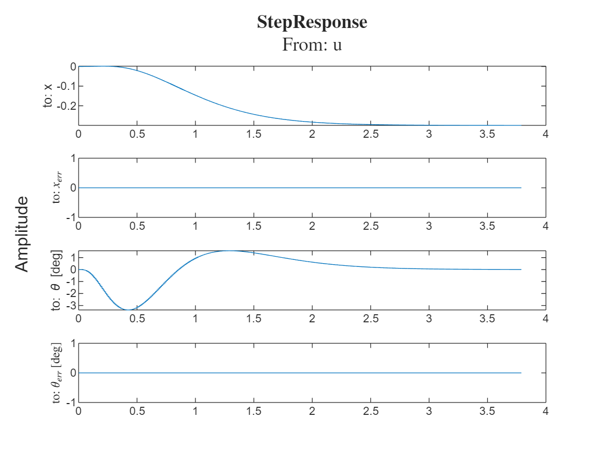

NOTE: in order to simulate the system correctly, I needed to setup the initial error of the system. On a real system, we'd only have the initial error from the measured states \- obtained via the observations.

```matlab
figure;
x0 = [0.5; 0; 5*pi/180; 1*pi/180; 0];
x0err = [x0(1); 0; 0; x0(4)]; % assume we measure x and theta_dot
xinit = [x0; x0err];
[~,~,xlsim] = lsim(clsys,ones(size(tOut)),tOut,xinit);
t2 = myplot2(tOut,xlsim);
title(t2, {" $\bf I.C.\ Response$ "; "From: u"}, 'Interpreter', 'Latex')
```

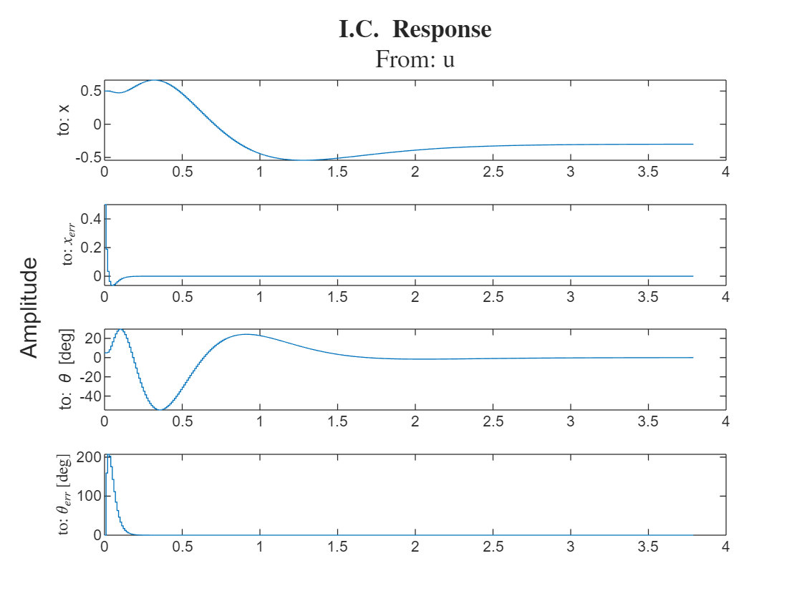

```matlab
figure; % control effort
u = -Ks*xlsim(:,6:9)' - Ki*xlsim(:,5)';
stairs(tOut,u)
ylabel('Newtons')
title('Control Effort')
```

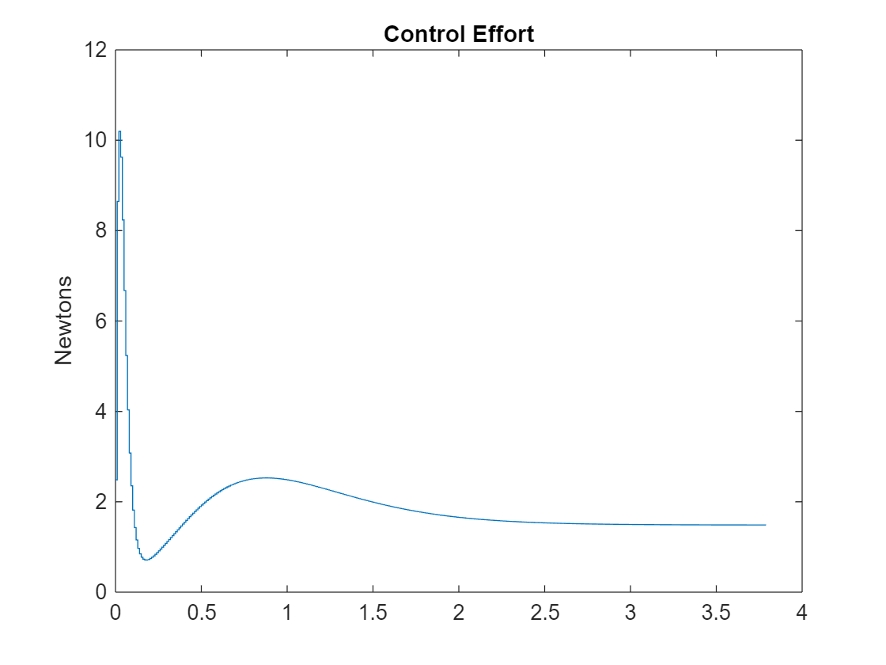

```matlab

figure;
t3 = tiledlayout(4,1);
title(t3,'Error Response')
ylabel(t3, 'Amplitude')
nexttile;
stairs(tOut,xlsim(:,6));
ylabel('to:  !!!EQ_20!!! ','Interpreter','latex');
nexttile;
stairs(tOut,xlsim(:,7));
ylabel('to:  !!!EQ_21!!! ','Interpreter','latex');
nexttile;
stairs(tOut,xlsim(:,8));
ylabel('to:  !!!EQ_22!!! ','Interpreter','latex');
nexttile;
stairs(tOut,xlsim(:,9));
ylabel('to:  !!!EQ_23!!! ','Interpreter','latex');
```

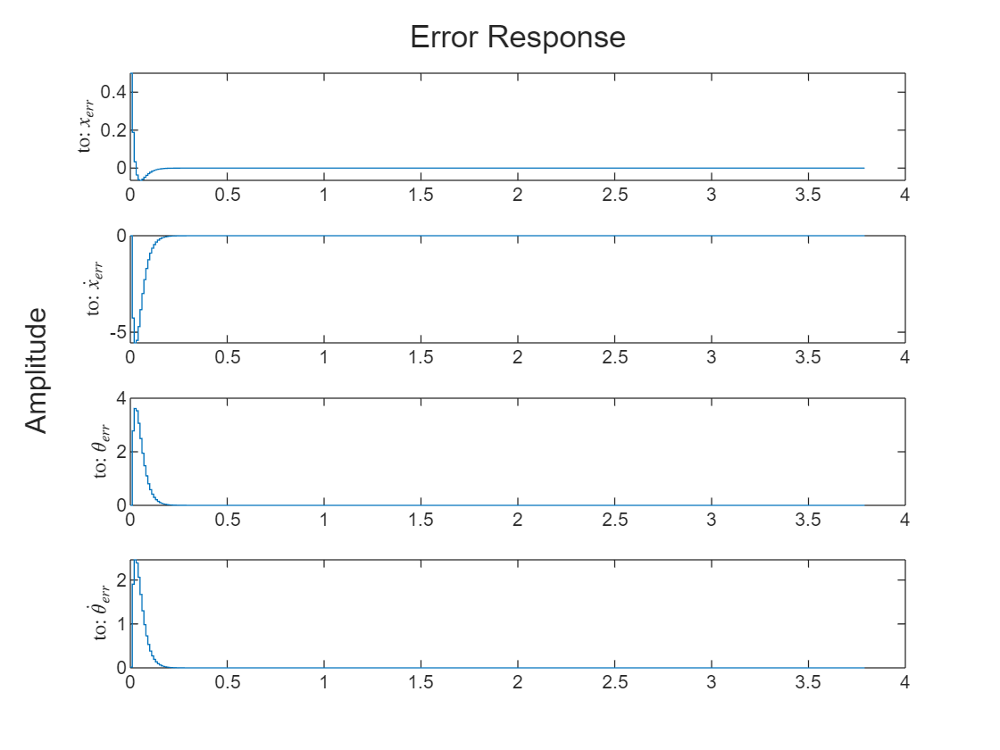

```matlab

function t = myplot(tOut,x)
    t = tiledlayout(4,1);
    title(t, {" !!!EQ_64!!! "; "From: u"}, 'Interpreter', 'Latex')
    ylabel(t, 'Amplitude')
    nexttile;
    stairs(tOut,x(:,1))
    ylabel('to: x')
    nexttile;
    stairs(tOut,x(:,5)) % xhat = x - xtilde
    ylabel('to:  !!!EQ_20!!! ', 'Interpreter','latex')
    nexttile;
    stairs(tOut,x(:,3)*180/pi)
    ylabel('to: \theta [deg]')
    nexttile;
    stairs(tOut,x(:,7)*180/pi)
    ylabel('to:  !!!EQ_22!!!  [deg]', 'Interpreter','latex')

end

function t = myplot2(tOut,x)
    t = tiledlayout(4,1);
    title(t, {" !!!EQ_64!!! "; "From: u"}, 'Interpreter', 'Latex')
    ylabel(t, 'Amplitude')
    nexttile;
    stairs(tOut,x(:,1))
    ylabel('to: x')
    nexttile;
    stairs(tOut,x(:,6)) % xhat = x - xtilde
    ylabel('to:  !!!EQ_20!!! ', 'Interpreter','latex')
    nexttile;
    stairs(tOut,x(:,3)*180/pi)
    ylabel('to: \theta [deg]')
    nexttile;
    stairs(tOut,x(:,8)*180/pi)
    ylabel('to:  !!!EQ_22!!!  [deg]', 'Interpreter','latex')

end
```
