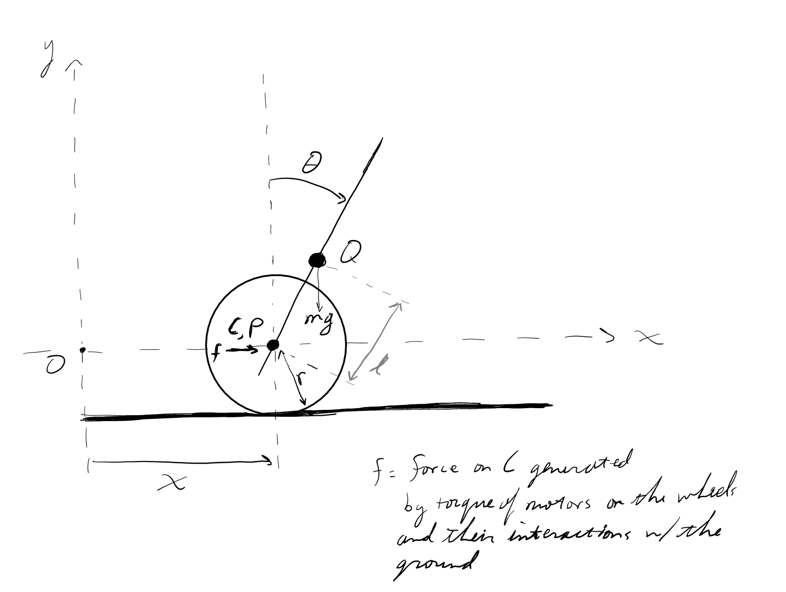

# Wheeled Balancer Equations Derivation

Author: Teo Wilkening

reference: Green, C. D. (2020, January 4). *Equations of motion for the CART and Pole Control Task*. SharpNEAT. Retrieved August 14, 2022, from [https://sharpneat.sourceforge.io/research/cart\-pole/cart\-pole\-equations.html](https://sharpneat.sourceforge.io/research/cart-pole/cart-pole-equations.html) 

## Table of Contents
&emsp;[Variables](#variables)
 
&emsp;[Conventions](#conventions)
 
&emsp;[Equations of Motion](#equations-of-motion)
 
&emsp;&emsp;[Initial Setup](#initial-setup)
 
&emsp;&emsp;[Absolute Acceleration of Pole](#absolute-acceleration-of-pole)
 
&emsp;&emsp;[Inertial Force on Point Q](#inertial-force-on-point-q)
 
&emsp;&emsp;[Forces on the Cart](#forces-on-the-cart)
 
&emsp;&emsp;[Rotational Forces on Pendulum](#rotational-forces-on-pendulum)
 
&emsp;&emsp;&emsp;[1) Moment due to Gravity](#1-moment-due-to-gravity)
 
&emsp;&emsp;&emsp;[2) Inertial force resisting movement from the cart](#2-inertial-force-resisting-movement-from-the-underline-cart-)
 
&emsp;&emsp;&emsp;[3) Moment of Inertia (rotational)](#3-moment-of-inertia-rotational-)
 
&emsp;&emsp;&emsp;[To sum it up:](#to-sum-it-up-)
 
&emsp;&emsp;[Rotational Inertia Constant J](#rotational-inertia-constant-j)
 
&emsp;&emsp;[Adding in Friction](#adding-in-friction)
 
&emsp;&emsp;[Cart Wheel Bearings](#cart-wheel-bearings)
 
&emsp;&emsp;[Equations of Motion with Friction](#equations-of-motion-with-friction)
 
&emsp;[Equations of Motion with Torque from the motors as the input](#equations-of-motion-with-torque-from-the-motors-as-the-input)
 

# Variables

g = gravity = 9.8 m/s^2

J = inertial constant of the pole

x = cart position

th = $\theta$ = pole angle w.r.t. vertical up, +90deg when horizontal to the right

m = mass of the pole

 $m_c$ = m\_c = mass of the cart

M = m + $m_c$ 

 $\mu_c$ = mu\_c = friction coefficient of the cart

r = radius of the cart wheels

f = force applied to the cart (via the torque generated by its motors)

l = location of the CoM of the pole

O = origin

Q = CoM of the pole

P = pivot point of the pole

C = CoM of the Cart

# Conventions
-  Positive force = push to the right 
-  vertical force = push upwards 
-  + angular velocity = clockwise rotation 
-  + angular accel. = clockwiswe accel.  
-  positive moment = torque in anti\-clockwise direction ( $+\tau \Rightarrow -\ddot{\theta}$ )  

# Equations of Motion
## Initial Setup

Take the positions of interest, P & Q and perform differentiation in the P frame (the cart's frame):

 ${\dot{x} }_{q|P} =l\dot{\theta} \cos (\theta )$ , ${\ddot{x} }_{q|P} =-l{\dot{\theta} }^2 \sin (\theta )+l\ddot{\theta} \cos (\theta )$ 

 ${\dot{y} }_{q|P} =-l\dot{\theta} \sin (\theta )$ , ${\ddot{y} }_{q|P} =-l{\dot{\theta} }^2 \cos (\theta )-l\ddot{\theta} \sin (\theta )$ 

However, these equations say **nothing** about the forces acting on the pole.

So, how do these all relate?

Centripetal force: $F_c =mv^2 /r=mr\omega^2 ,~~(v=\omega r)$ 

=> implies that $\dot{\theta}$ terms correspond to acceleration due to centripetal force (x\-term 0 at vert, y\-term 0 at hor.)

 $\ddot{\theta}$ terms $\to$ due to angular acceleration $\to$ should always be $\perp$ to pole

## Absolute Acceleration of Pole

Need to add in cart accleration because we want the motion relative to the origin, not relative to the cart's origin:

 $ {\ddot{x} }_q ={\ddot{x} }_{q|P} +{\ddot{x} }_c =l(\ddot{\theta} \cos (\theta )-{\dot{\theta} }^2 \sin (\theta ))+{\ddot{x} }_c $ 

 $ {\ddot{y} }_q ={\ddot{y} }_{q|P} =-l(\ddot{\theta} \sin \theta +{\dot{\theta} }^2 \cos \theta ) $ 

## Inertial Force on Point Q

d'Alambert's Principle: all forces external and internal must sum to 0

 $ F=ma\Rightarrow F-ma=0\Rightarrow F+F^* =0\Rightarrow \sum f^* =0,~~F^* =-ma $ 

so, inertial force of pendulum point mass Q:

 $(F_q^i )_x =-m{\ddot{x} }_q =-m(l\ddot{\theta} \cos \theta -l{\dot{\theta} }^2 \sin \theta +{\ddot{x} }_c )$           (10)

 $(F_q^i )_y =-m{\ddot{y} }_q =ml(\ddot{\theta} \sin \theta +{\dot{\theta} }^2 \cos \theta )$                     (11)

## Forces on the Cart
-  external force f 
-  force transmitted by the pendulum @ point P via inertial force 
-  gravity of point Q (x\-axis only though, so does not impact EOM of cart in x\-direction) 
-  cart's own inertial resistance 
-  (friction to be added later) 

x\-axis only b/c assume no ranslation in y:

 $ f-m_c {\ddot{x} }_c +(F_q^2 )_x =0 $ 

 $ \Rightarrow f-m_c {\ddot{x} }_c -m(l\ddot{\theta} \cos \theta -l{\dot{\theta} }^2 \sin \theta +{\ddot{x} }_c )=0 $ 

 $ \Rightarrow f=m_c {\ddot{x} }_c +m(l\ddot{\theta} \cos \theta -l{\dot{\theta} }^2 \sin \theta +\ddot{x_c } )~~~~~~(12) $ 

## Rotational Forces on Pendulum
1.  gravity
2. inertial force resisting movement from cart
3. rotational inertial force

### 1) Moment due to Gravity
 $ x=l\sin \theta $ 

let $1_R (l)$ be the radial vector along the pole: $1_R (l)=\left\lbrack \begin{array}{c} l\sin \theta \newline l\cos \theta \newline 0 \end{array}\right\rbrack$ 

 $ M_g =[1_R (l)\times F_g ]\Rightarrow \left\lbrack \begin{array}{ccc} i & j & k\newline l\sin \theta  & l\cos \theta  & 0\newline 0 & 0 & mg \end{array}\right\rbrack \Rightarrow mgl\cos \theta \hat{i} -mgl\sin \theta \hat{k} $ 

taking only the z\-axis component as relevant 

 $M_g =-mgl\sin \theta$   (negative sign because neg. torque is clockwise accel.)

### 2) Inertial force resisting movement from the cart
 $ M_q =[1_R (l)\times F_q^i ]_z ~~~~~(13) $ 

 $M_q =ml[\sin \theta (l(\ddot{\theta} \sin \theta +{\dot{\theta} }^2 \cos \theta ))+\cos \theta (l\ddot{\theta} \cos \theta -l{\dot{\theta} }^2 \sin \theta +{\ddot{x} }_c )]=ml(l\ddot{\theta} +\ddot{x} \cos \theta )$        (14)

(i.i. moment of inertia from point mass @ Q)

NOTE: eqtn 13, a cross prouct, is non\-commutative, so it must be in correct order (l x F) which gives us the direction of the torque. If force is positive to the right acting at the tip of the pole, then this produces a torque in the clockwise direction (negative torque per convention)

### 3) Moment of Inertia (rotational)
 $ M_i =J\ddot{\theta} $ 

The sign of M is (+) for positive $\ddot{\theta}$ , resulting in torque opposing the acceleration.

### To sum it up:
 $ M_g +M_q +M_i =0 $ 

 $-mgl\sin \theta +ml(l\ddot{\theta} +\ddot{x} \cos \theta )+J\ddot{\theta} =0$         (18)

## Rotational Inertia Constant J

Point mass fixed at a distance l: 

 $ J=ml^2 $ 

For a pole of equally distributed mass, the inertia for rotation about one end is:

 $ J=\frac{ml^2 }{3} $ 

In general, for some constant k:

 $ J=kml^2 $ 

## Adding in Friction
1.  Cart and track
2. pendulum pivot joint
3. air resistance (negligible)

Coulumb Friction approximation ( $\propto$ normal force)

Rotational friction: proportional to angular velocity (b/c ball bearings, friction so low we only account for viscous friction of the bearings)

static friciton: not going to model b/c likely will not matter for control (un\-stable equil point of system will never truly be "at rest")

NOTE that friction is always the opposite of the direction of motion.

## Cart Wheel Bearings
 $ F_f =-\mu_c N_c \frac{\dot{x} }{r} $

where we have divided by r for the angular velocity $\omega =v/r$ 

 $N_c =(F_q^i )_y -mg-m_c g=ml[\ddot{\theta} \sin \theta +{\dot{\theta} }^2 \cos \theta ]-Mg$       (30)

If the pendulum mass is low (not in our case), or it's angular velocity is always low (likely to be the case), then we can drop the terms related to the pole inertia. Thus our friction can be *approximated* as:

 $F_f =-\mu_c Mg\frac{\dot{x} }{r}$       (32\-R)

-  This is a good equation to use as an approximation for friction since it's proportional to velocity so there are no disconinuities around $\dot{x} =0$ for simulation/prep work on the control algorithm 

## Equations of Motion with Friction

add $F_f$ into (12) and (18):

 $ f=m_c {\ddot{x} }_c +m(l\ddot{\theta} \cos \theta -l{\dot{\theta} }^2 \sin \theta +{\ddot{x} }_c )-F_f $

 $\Rightarrow f=m_c {\ddot{x} }_c +m(l\ddot{\theta} \cos \theta -l{\dot{\theta} }^2 \sin \theta +{\ddot{x} }_c )+\mu_c Mg\dot{x} /r$          (12\-F)

 $-mgl\sin \theta +ml(l\ddot{\theta} +\ddot{x} \cos \theta )+J\ddot{\theta} =0$                         (18) 

(Eqtn 18 has no change since friction included only in cart equation of motion, 12\-F)

# Equations of Motion with Torque from the motors as the input

1.  calculations for converting torque from motors (more directly controllable) into force on the "cart"
2. calculations for converting rotation of the wheels (the actual state that I'm going to be able to measure) into displacement in x direction
3. anything else...
